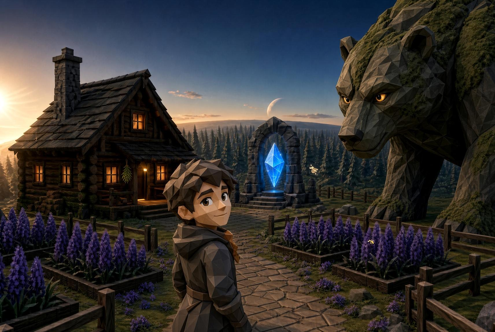
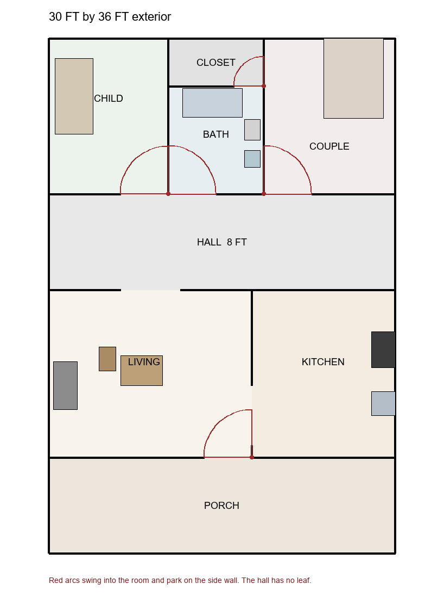
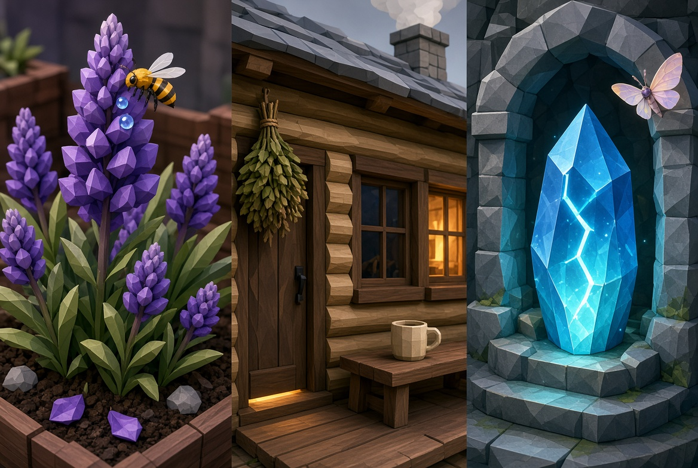
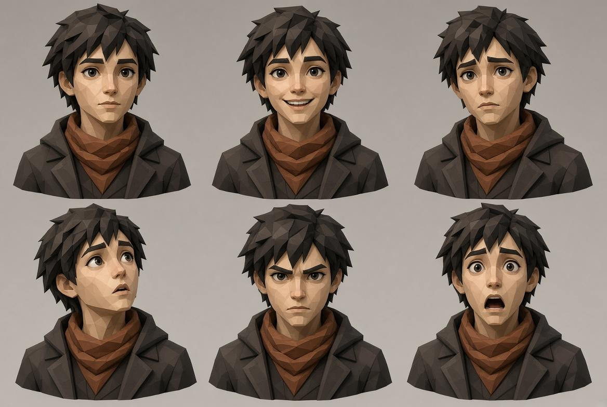
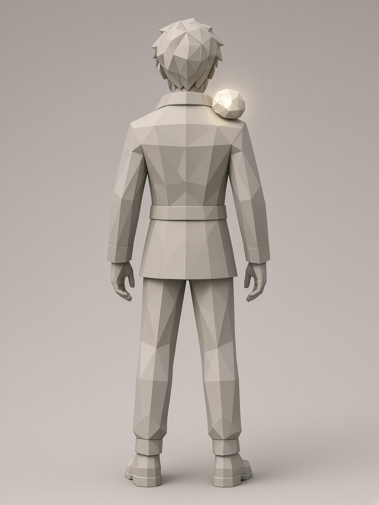
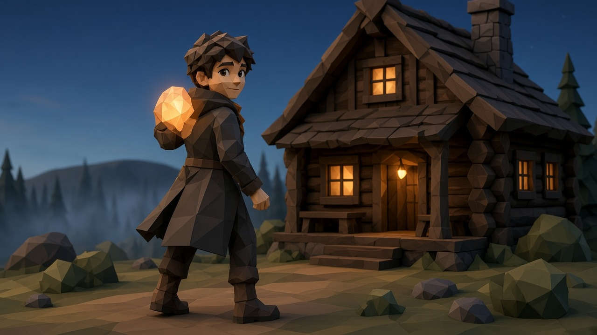
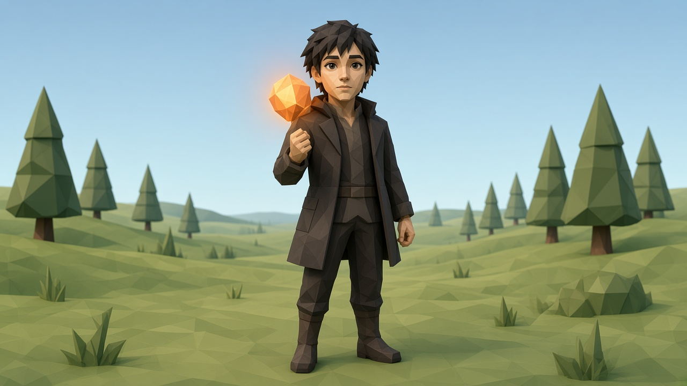
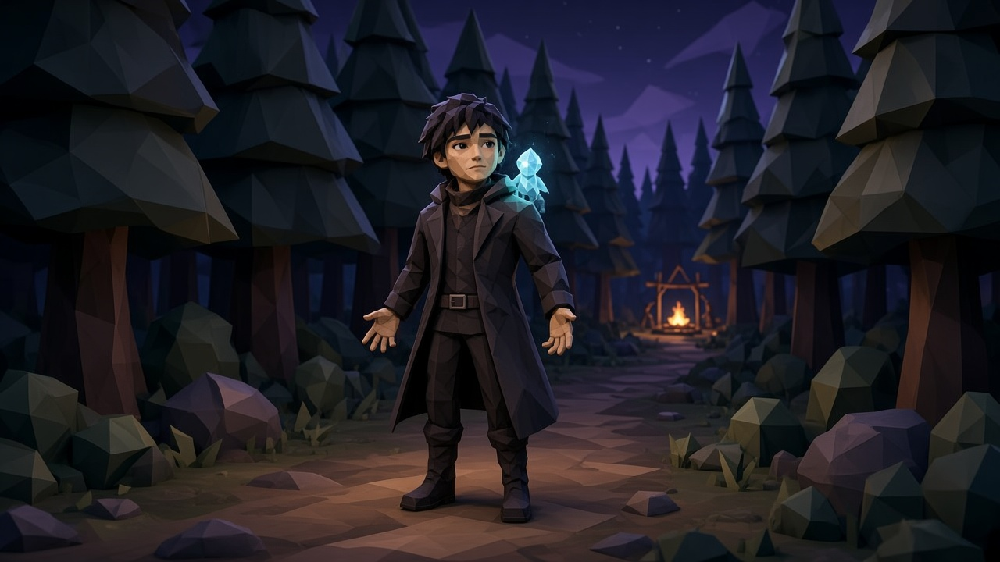

# Docs/02_ART_BIBLE.md

## Status: LOCKED — supersedes P2_AD_bible (2026-09-16) — pictures added 2026-10-09

**Owner:** AD (art half of Track C).  
**Single source of truth:** this file. Asset work from stills to mesh opens `Docs/context/ART_ASSET_DOOR.md`. Working packet: `Docs/context/ART_BIBLE_CONTEXT.md`. Write a changed cabin fact in both. `AssetCreation/STYLE_GUIDE.md` keeps the Blender export preset only and must not restate look law. `VisionBoard/` holds prompts and encoded key art; it does not override this bible.

**North stars (pictures, 2026-10-09):**

These three files lock face, light, and materials. Size is `Docs/art/homestead/HS_Vista_bear_module_v9.jpg`, kept 2026-10-10. The `.b64` names were never files in the repo.

- `VisionBoard/KeyArt/homestead_dusk_baseline.jpg` — dusk homestead. Player looking back, warm cabin, lupines, crystal shrine, cropped moss-bear.
- `Docs/art/homestead/HS_Wide.jpg` — homestead place pack, wide. Materials, night, and texture-off massing sit beside it in `Docs/art/STILLS_LIBRARY.md`.
- `VisionBoard/KeyArt/player_expression_sheet.jpg` — face lock. Calm, smile, worry, awe, determination, startle. The scarf in that sheet is not the signifier. A small spirit on the shoulder is.
- `VisionBoard/KeyArt/homestead_close_assets.jpg` — close assets. Lupine and bee, porch with herbs and cup, shrine crystal and moth.

Planetside camp is a locked location test: the player approaching three tired guards at a fire, starry pine-mountain backdrop. The 2026-09-30 armed-brute still is superseded. Encode the guard still when it is exported. Do not treat the 2026-09-16 split greybox as the current planetside contract.

Older refs `refs/keyart_homestead_night.jpg` and `refs/keyart_homestead_planetside_split.jpg` remain historical. They are not these pictures.

**Canon inputs:** `Docs/VISION_BOARD.md`, `Docs/00_SHOTLIST.md`  
**Stills library:** `Docs/art/STILLS_LIBRARY.md`  
**Phase words:** `Docs/art/PHASES.md` — five states, five transitions. The work is the open transition. Look law stays in this file.  
**Scale:** `Docs/art/SCALE.md` — one look, a repeated vista kit, a denser pocket, one giant. From Concept on.  
**Out of scope for this file:** material parameter sheets (TA → `Docs/02_MATERIAL_SHEET.md`).

Tone lock: warm, readable, handmade, hopeful. Fantasy, not high fantasy. Cartoon, not Disney. Closest cousins: Breath of the Wild + Pixar sincerity. Not cutesy-infantile. Not grim. Not photoreal. Not sci-fi.

---

## 1. What the game looks like

HomeWorld is **semi-polygon with detail on top**.

- Big forms are faceted low-poly masses. Not flat untextured low poly. Not photoreal. Not Mario-Galaxy soft clay.
- Surface life sits on those facets: wood grain, moss clumps, flower clusters, crystal faces, leather straps.
- Most of the frame is scenery ahead of the player.
- The player is 1.8 m and is not from this planet. The cottage is the drawn 30 by 36 ft home, walls 15 ft. The bear and the bull match that wall, 4.57 m at the shoulder. Pines are 4.57 m, 6.86 m, and 9.14 m. The giant is many times the cottage. Camp guards stay people. The meters are `Docs/art/SCALE.md`.
- Planetoid read: close horizon, ground can feel like it bends away, thin air, deep zenith, readable constellations at night.

If a change makes the facets disappear, it is the wrong kind of beauty.

Rejected: flat shade, posterized color bands, chunky-toy restyle, photoreal scans, featureless hooded player.

---

## 2. Locked key art

### Homestead (primary contract)

Dusk on the floating-island hub. This picture is the basis.

- Faceted Zelda/Pixar adventurer looking back, readable face. Dark coat, a small spirit on the shoulder, the face from the expression sheet.
- Log cabin with warm uneven windows, porch lamp, hanging herbs.
- Lupine beds with one living visitor (bee).
- Shrine crystal with a moth.
- Giant cropped moss-bear with brow shelves and eyes that look.
- Warm sun left, cool forest right, thin air, planetoid moon.
- The cottage is the home. Room plan 30 ft wide by 36 ft deep (9.14 m by 10.97 m). Covered porch 30 ft by 8 ft. Log walls 6 in. Interior 29 ft wide by 35 ft deep. Wall height 15 ft (4.57 m), so a third-person camera can sit above a 1.8 m player. Each bedroom is its own room: at least 70 sq ft and 7 ft on every side. This layout is the first cottage. Later kits may be modular. The bear’s shoulder matches this wall height. Modules: `Docs/art/SCALE.md`.

Doors. Every leaf is a 4 ft clear opening. It swings into its own room and lies flat against the nearest side wall. The swing arc is empty. No leaf swings into the hall.

Plan, front (south) to back (north):

- Porch across the front.
- Living room, front left, 17 ft wide by 14 ft deep. Entry door in the southeast corner. Hinge on that corner. A 90 degree swing parks the leaf against the wall shared with the kitchen. Chimney and wood stove on the west wall, outside the swing. Seat and table sit north of the swing.
- A 5 ft cased opening, no leaf, centered on the living room’s north wall, into the hall.
- Kitchen, front right, 12 ft wide by 14 ft deep. A 5 ft cased opening into the living room, near the front. No leaf. One wood counter, 24 in deep, on the east wall, clear of that opening: a simple iron cookstove, a kettle on the stove, and one sink. No refrigerator.
- Hall, full 29 ft width by 8 ft deep. No door leaves in the hall. The living room opens into it. The kitchen does not.
- Child’s room, back left, 10 ft by 13 ft. Door on the south wall, at the east side. Hinge on the east. The leaf parks on the east wall. Twin bed on the west wall, outside the swing.
- Bathroom, back center, 8 ft by 9 ft, with an 8 ft by 4 ft closet behind it. Door on the south wall. Hinge on the west. The leaf parks on the west wall. Tub on the north wall. Toilet and basin on the east wall, north of the swing.
- Couple’s room, back right, 11 ft by 13 ft. Door on the south wall, at the west side. Hinge on the west. The leaf parks on the west wall. Queen bed, 5 ft by 6 ft 8 in, on the north wall, shifted east so the west side is the door pocket. The open doorway shows the bed from the hall.

### Close assets

The same homestead, close. Bee, porch, crystal.

### Face

Same person. Brow, lid, and mouth are planes. Order: calm, smile, worry, awe, determination, startle.

### Planetside (second location test)

Night camp on the planet below.

- Same player approaching a campfire, sightline readable from outside.
- Three guards. Same face planes as the player. Tired. Varying stance, not a new species.
- No weapon render. A stick is a stick. Not club, sword, or bow.
- The loved one is seated, same scarf, no cage.
- Starry sky with readable constellations, mountain ridge, pine forest.
- Fire is the homestead-window trick: the only warm light.

If a new biome cannot produce a shot this clear, the biome is not ready.

---

## Appendix A. Outstanding placeholders - a "photo -> simple placeholder" note (2026-10-08)

Every item below is greybox or an `authored, not built` stub today. The note for
each says which photograph to use as the look target when shaping its simple
placeholder version. The placeholder's job is family-read at 20 m from the locked
signature rows (§2, seven families), not finish. Materials stay on the ten
masters. If a placeholder can't carry its family by silhouette alone, the note is
wrong and the placeholder fails the 20 m read test until it does.

| Slot | What it must read as | Photo to shape the simple placeholder from |
|---|---|---|
| `SM_Camp_Fire` | The tallest thing among its neighbours, warm light | A small campfire at dusk, seen from the path into the clearing |
| `SM_Camp_GuardStake` | "a post a guard stands at", one stick not a sentry box | A watch-post stake by a forest trail |
| `SM_Camp_Bedroll_A/B` | Sleeping person's bedrolls, allies made by someone kind | Two neat bedrolls beside a campfire |
| `SK_Partner_Taken` | Partner seated, same scarf, someone missing you, no cage | A seated figure by a fire, unbound |
| Field treeline (two identical edges) | Indistinguishable pine forest walls — the choice must be preference | Standing at the edge of a pine stand, looking straight into it |
| `SM_Herb_Clump_01` | Low wild herb you walk past, waist-high, M_GatherHerb | A clump of wild herbs in a meadow |
| `SM_Beast_Pad_A/B` | A worn stamping ground, where great beasts bed down | A deer bed / wild boar wallow |
| `SM_Dung_Pile_01` | Dung, small (0.15 m), hidden by the 0.9–1.2 m grass | Stock photo of a small dung pile, used for scale |
| `SM_SpiritWound_01` | Vertical, tall, see-through gap, cracked or broken arch — a thing you approach | A cracked standing stone or broken arch, low angle, against sky |
| `SM_Shrine_Homestead` | Standing stone, about twice player height, the night portal | A weathered standing stone, seen straight on at dusk |
| Companion NPC | The partner, seated, readable at 20 m as someone missing you | A seated figure by a fire |
| Great bull | Big, planted, heavy head, rideable; calm, not a boss | A big cow/bull standing in a field |
| Clouds | Soft spirit-blue cotton, no clipping through the pawn's head | Round low cumulus, backlit |

The rune is removed. Do not author a rune stone or a rune plane.

Reject for placeholders: anything photoreal, featureless hooded figures, anything that breaks the 2D cartoon line-weight, and any item that reads as the same silhouette as a different family. The §2 homestead/planetside contracts still win where they conflict.

---

## 3. Player

Unique but non-descript. A person, not a logo.

- Young-adult adventurer, slightly androgynous.
- Short geometric hair in a few faceted clumps.
- Muted charcoal-brown coat. A small spirit rides the shoulder. That spirit is the far signifier and the five-step stack read. No scarf. No ornate armor.
- Adult head about one sixth of height. Child head larger, about four to five heads. Eyes graphic and clear.
- Face built from planes that act: brows, eyelids, mouth corners.
- Not a featureless hood. Not a realistic hoodie. Not a Disney princess. Not a high-fantasy chosen one.

Spend triangles on the face. The coat stays cheap.

Emotion kit to author: calm, smile, worry, awe, determination, startle.

The player is a scale ruler and an actor in close shots. The world still carries the wide frame. Partner, child, and the three camp guards share this face kit. Hair and accent differ.

Some creatures are spirit by day and by night. Animals and humanoids, including the player, have a day body and a spirit form. They enter the spirit realm only while asleep. The shoulder spirit is the always-spirit kind.

---

## 4. Creatures and people

Same face law as the player.

- Eyes, brow shelves, lids, a muzzle or mouth that can change.
- A snarl and a soft look are two poses of one face, not two models.
- Beasts stay faceted stone / moss / leather.
- Scale for beasts: much larger than the player. Tallest members may crop the frame.
- A group must vary in stance or height.

Homestead guardian: the moss-bear is the wild module, often cropped, threat or quiet watcher depending on pose and light. The field bull matches that module. The player rides the bull. A pine and a lupine are that size too. A lupine is tall enough to stand under.

Planetside camp: three tired guards around a fire. Same face planes. Not a new species. Not gore. Not cute Disney animals. Not armed brutes.

The 2026-09-16 “no extra beasts / no combat staging” reject is superseded for the homestead bear only. The 2026-09-30 armed-brute camp is superseded by the three guards. Do not add a fourth species or a combat arena.

---

## 5. Two-layer build method

### Layer A — Structure

Cheap mass that holds silhouette, collision, and facet lighting. Cut facets on purpose. Shade by face. Hard edges. Do not smooth into subdivision clay. Collision uses the structure, never the flowers.

### Layer B — Detail kit

Reusable pieces snapped onto the mass. Starter kit: moss clump, lupine sprig, fence module, path stone, wood trim strip, window pane, extra crystal shard.

If a piece cannot be reused on three props, it is too unique. Hero exceptions: crystal, beast heads, cabin door, player face.

### Layer C — One living eye per important object

| Object | Cheap mass | The eye (pay here) | Cull far away |
|---|---|---|---|
| Player | Simple coat | Face | Never in intimate cam |
| Beast / guard | Faceted body | Eyes + brows | Eyes stay |
| Cabin | Faceted logs | Brightest window + door leak + smoke + one porch item | Smoke and porch item |
| Flower bed | Instanced sprigs | One leaning hero stalk + one bug + two dew drops | Bug and dew |
| Crystal | Outer gem | Inner shard + pulse + moth | Moth |
| Campfire | Log pile | Flame + one pot or rack | Spark detail |

A second eye on the same object usually adds noise, not life.

---

## 6. Camera

Two distances. Same assets. Never rescale a mesh to cheat a lens. The play camera stays near the body and looks up, or the wild module stops feeling large. A scenic frame may lose the face.

| Mode | Distance | What must read | What may simplify |
|---|---|---|---|
| Play | Low, near the 1.8 m body, among the secret rooms, under a bloom, or on the bull | Face, the gap, grain, the door the player fits | The far forest |
| Scenic | Pulled back | The bear, the cabin shell, the pine repeat, the giant’s back | Interior rooms, the face |

About 20 feet is the play distance beside the body. It is not the size of a pine.

---

## 7. Palette and lighting

Primary contrast is **warm amber vs cool night / forest**. Keep both readable. Never collapse into muddy mid-gray or pitch black.

| Chip | Role | Notes |
|---|---|---|
| Cabin amber | Window / porch / door leak | Warm golden; one window brighter than the others |
| Fire amber | Planetside key | Same job as the window |
| Crystal cyan | Shrine jewel | Tight bloom, inner shard, no lawn-wide neon |
| Navy sky | Night backdrop | Deep zenith, readable constellations |
| Warm horizon | Dusk | Thin air, close planetoid limb |
| Spring grass / lupine | Homestead ground | Quiet ground, loud flowers |
| Warm dark wood | Cabin / planters / rails | Handmade, not scan wood |
| Moss stone | Bear / shrine | Faceted, moss on upward and shaded faces |

Night is a parameter + overlay, not a second map. `NightMix` 0→1 shifts the ten masters. Do not duplicate meshes to “do night.”

Emotion is climate around the same silhouette: window color, garden health, sky, smoke, beast proximity, fire alive or dead. Do not rebuild the cabin to change mood.

One main key at a time: dusk sun, campfire, or shrine cyan, plus a cooler fill. Emissives are jewels.

---

## 8. Shape language (kept)

| Element | Rule |
|---|---|
| Cliff / island | Layered torn earth. Never a pancake disc or cylinder plug. |
| Pines | One conical pine. Small 4.57 m, medium 6.86 m, largest 9.14 m. No second tree species. |
| Cabin | A wild-scale log shell, gabled, stone chimney ok. The rooms inside are the player plan. Cozy, not Victorian, not sci-fi. |
| Shrine / portal | Handmade spirit cue. Standing stone. Not a tech gate or neon ring. No rune. |
| Planet below | Pine valley, path, mountain ridge, camp clearing. |

Readable silhouettes beat detail.

### Per-family signature silhouettes (2026-10-01)

A **zone type is a mechanic family**, not a biome. TG-ZONE-FAMILY settled that a section
*is* a family of mechanics and that geography is authored to announce it; TG-ZONE-VOCABULARY
confirmed the family is the art vocabulary and that `EBiomeType` is terrain dressing only.
The consequence is mechanical, not polish:

> A family that cannot be told apart **by shape from 20 m away** has failed its section.
> No HUD may rescue it.

Every family therefore carries one signature silhouette, and no two families may share a
scale band. This table is **locked taste** — see
[handoffs/TASTE_GATE_GRAYBOX_SILHOUETTE.md](handoffs/TASTE_GATE_GRAYBOX_SILHOUETTE.md) and
taste-profile §3. Machine form: `Content/Python/homeworld_graybox_silhouette.py`.

| Family | Signature silhouette at 20 m |
|---|---|
| `gather` | low wide soft mound, reads as a spreading patch |
| `nurture_tame` | broad low pad with a raised rim you can see over |
| `heal` | narrow upright, single soft column |
| `spirit` | tall thin vertical **with a see-through gap** |
| `stealth` | low broken horizontal, never a closed mass |
| `build_place` | flat square plate, deliberately dull |
| `combat` | jagged asymmetric wedge, tallest in frame |

**Traversal is the spine, not a family.** Paths, the lookout pad, the glide perch, islets and
the landing circle carry no silhouette of their own; they inherit the neighbouring family's
material and are excluded from the collision check. Hub volumes (cabin, garden, pines) carry
`build_place` — the cabin is that family's signature landmark.

**Current state:** only `build_place` has authored volumes. `heal`, `stealth` and `combat`
have **no volume anywhere** in the 39-volume layout, so those families are taught nowhere.
`gather`, `nurture_tame` and `spirit` are measured and **non-conforming**: they read flatter
and squarer than their signature. Authoring them is level design — Lead-owned, not invented.

**First prototype: `spirit`** (Lead, 2026-10-01, `TG-ZONE-VOCABULARY` Round 2). It is the
only family both already placed in the world *and* already failing its own signature, so the
before and after are measurable. The **gap is authored in real topology** — four posts and a
lintel — because the spirit signature is the only one whose defining feature is not a
proportion. Correct the existing shrine assemblies in place; do not author rival ones beside
them. Drafts only — nothing promotes to `Content/` without a sidecar and an
`AI_ASSET_LOG` row (Docs/20).

---

## 9. Shots — approval criteria

Approve against `Docs/00_SHOTLIST.md` plus the north stars.

| Shot | Pass when | Fail when |
|---|---|---|
| Homestead dusk contract | Expressive player, uneven warm windows, bee, moth, cropped bear eyes, facets intact | Hooded blank, dead windows, smoothed meshes, photoreal |
| Cabin close | One brighter window, door leak, one porch item, facet wood | Clutter kit, dark windows, scan wood |
| Glide | Lookout edge, islets, same pine language, world stays large | Free-flight sim, new biome, rescaled assets |
| Planet camp | Three tired guards, same face planes, fire as the warm eye, stars + mountain + pines, sightline from outside | Armed brutes, a cage, gore, Disney animals, grim void |
| Spirit shrine night | Crystal cyan answering cabin gold, same masters, standing stone | Neon tech portal, a rune, rebuilt geometry for night |

**Still rejected:** photoreal scans, grimdark, sci-fi kits, pancake islands, tiny white moon, dead night windows, extra tree species, smoothing facets away, rescaling per camera, legendary outfits, a rune.

---

## 10. Naming and masters (unchanged)

Prefixes: `M_` `SM_` `SK_` `FX_` `PCG_` `BP_` `CAM_` `LIT_`  
Suffixes: `_Day` `_Night` `_Spirit` `_Nurtured` `_World` `_Stored`

Ten masters only (instance; do not invent families):

1. `M_StylizedGrass`
2. `M_CliffRock`
3. `M_WoodCabin`
4. `M_WoodWild`
5. `M_FoliageCard`
6. `M_PathStone`
7. `M_GatherHerb`
8. `M_BeastStylized`
9. `M_SpiritUnlit`
10. `M_Nurtured`

Each exposes BaseColor, Roughness, Variation, NightMix 0–1, optional Emissive.  
Scale: meters. Adult about 1.7–1.8 m. Head about one sixth of that height. Cottage walls 4.57 m. Bear and bull shoulder 4.57 m. Pines 4.57 m, 6.86 m, and 9.14 m. The lair giant is many times the cottage. The bull rides the giant’s back. Origins at ground contact. Apply scale. Do not scale the player up to the cottage.

AD does not author the material sheet. TA owns parameter ranges.

Nanite is optional on solid static masses. Not on the player, flowers, bugs, or moths. Those use instances and LODs.

---

## 11. Pipeline

Blender library first. Unreal is assembly.

- `HW_Kit_Structure` — cabin, shrine, path, fence, player body, beast bodies
- `HW_Kit_Detail` — moss, sprigs, chips, trim, panes, shards, bugs, moths
- `HW_Atlas` — shared trim / moss / flower / rock
- `HW_Hero` — crystal, heads, door handle, player face

Profile the expensive view: flower beds, or the campfire looking across at the three guards.

---

## 12. Open, not locked

- Day-body planetside palette of the camp
- Dawn-after-storm homestead
- Beasts beyond the moss-bear and the field bull

Partner, child, and the three guards share the player face kit. That is locked for the prototype. The camp is three tired guards, not three armed brutes. The rune is removed.

---

## 13. Downstream

| Role | Use this bible for |
|---|---|
| TA | Chips, NightMix, ten masters |
| ENV / PROP | Facets, kit reuse, one living eye |
| LIT | Dusk sun, fire, crystal, moon size |
| QA | Homestead baseline + camp test + shot table |

**Evidence:** 2026-09-16 P2 lock retained where it does not conflict. 2026-09-30 player, living-eye, and homestead baseline supersede the hooded silhouette. 2026-10-08 camp guards and the removed rune supersede the armed-brute still and the rune rows.
