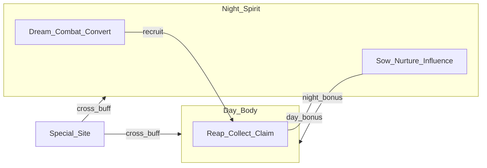

# Docs/21 — Reap & Sow (RS)

| Field | Value |
|-------|-------|
| **Status** | **CLOSED / COMPLETE** — Lead **`APPROVE RS-E`**, 2026-09-19 ET (RS-A…E all approved) |
| **Date** | 2026-09-19 |
| **Author** | Conductor (HomeWorld) |
| **Baseline main** | `6aab4cd` — Docs/20 allowlist live; VS_MVP dress on main |
| **Prior track** | [20_UASSET_AI_POLICY.md](20_UASSET_AI_POLICY.md) **APPROVED / COMPLETE** — Lead **`APPROVE UASSET POLICY`**, 2026-09-17 ET |
| **Prefix** | **RS** — do **not** reuse D19 / VP2 / PL / NP gate strings |

---

## Gate

Lead **`APPROVE RS STRATEGY`**, 2026-09-19 ET — **GRANTED**. Unlocks **RS-A**. Subsequent phases stay locked until their **`APPROVE RS-*`** gates.

**RS-A:** Lead **`APPROVE RS-A`**, 2026-09-19 ET — **GRANTED**. Unlocks **RS-B** (material triad).

**RS-B:** Lead **`APPROVE RS-B`**, 2026-09-19 ET — **GRANTED**. Unlocks **RS-C** (animal den). CLOUD script + handoff filed; DESKTOP PIE table deferred (MCP offline at stamp).

**RS-C:** Lead **`APPROVE RS-C`**, 2026-09-19 ET — **GRANTED**. Unlocks **RS-D** (humanoid camp). CLOUD den + dream stub filed; DESKTOP PIE deferred.

**RS-D:** Lead **`APPROVE RS-D`**, 2026-09-19 ET — **GRANTED**. Unlocks **RS-E** (special cross-bonus). CLOUD camp + dream stub filed; DESKTOP PIE deferred.

**RS-E:** Lead **`APPROVE RS-E`**, 2026-09-19 ET — **GRANTED**. Docs/21 Reap & Sow track **CLOSED / COMPLETE**.

**Next gate:** None on this track — next product track TBD (Lead gate).

**Do not stamp phase APPROVED in a PR** — Lead types the gate string in chat.

---

## Goal

Stamp and ship the Lead day/night product spine on the **VS_MVP planet path**:

- **Day (body)** = **reap** — collect / claim from animals, plants, and materials
- **Night (spirit)** = **sow** — nurture / influence; **astral combat** battles the **dreams** of animals, spirits, and humanoids to **heal and recruit** them (convert, do not kill)
- **Planet sites:** humanoid camp, animal den, flowers, rocks, trees, plus one **special site** whose day and night bonuses **differ** and **cross-buff** the other half

**Track success:** Player can visit all six site types with readable day vs night verbs; special-site night bonus improves day (and day bonus improves night); dream encounters convert/heal/recruit via **placeholder** combat — never kill.



---

## Canon (Lead — chat 2026-09-18 / 2026-09-19)

| Principle | Statement |
|-----------|-----------|
| Day / night duality | Day is collection and reaping; night is nurturing and sowing |
| Living + materials | Same pattern for animals, plants, and materials |
| Purpose | Gather items and bonuses that make the player perform better during **both** day and night |
| Astral combat | Battles the **dreams** of animals, spirits, and humanoids to help **heal** them and **recruit** them |
| Convert, not kill | Matches Vision convert / strip-sin → loved form; win condition is heal/recruit |

**Relationship to signed GDD:** [01_GDD_MVP.md](01_GDD_MVP.md) already has day gather/tame and night heal/nurture. Docs/21 **extends** that spine with the full site kit and dream-combat fantasy. **RS-A** (after strategy approval) patches Docs/01 (+ short Vision pointer). Do **not** amend Docs/01 until **`APPROVE RS STRATEGY`** then **`APPROVE RS-A`**.

Older VisionBoard “night = astral kill combat” flavor is **superseded for this track** by dream-convert framing.

---

## Site kit (canonical)

| Site | Day (body — reap) | Night (spirit — sow / dream) |
|------|-------------------|------------------------------|
| **Trees** | Gather wood / materials | Nurture / spirit-influence for next-day yield |
| **Rocks** | Mine / collect | Night influence for day reaping |
| **Flowers** | Gather herbs / fiber / related RES | Nurture / dream-tend for next-day yield or quality |
| **Animal den** | Collect from / claim helpers after recruitment | Dream-battle → heal → tame / recruit |
| **Humanoid camp** | Visit / collect from recruited | Dream-battle → heal → recruit |
| **Special site** | Bonus A (feeds **night**) | Bonus B (feeds **day**) — same landmark |

**Special site:** One hinge place readable from the lookout. Night-collected bonus improves day performance (reap, yield, tame success). Day-collected bonus improves night performance (dream combat, heal, nurture, recruit chance).

---

## Non-goals

| Out | Why |
|-----|-----|
| Free-flight / flight HUD | FALLBACK glide only (Docs/07 / FALLBACK FLIGHT) |
| Deep combat systems | Placeholder dream encounter only; no full GAS/combo vision-board pass this track |
| Kill combat | Convert / heal / recruit only |
| Full planetoid proc-gen | VS_MVP path sites only |
| Family / tutorial reopen | Docs/07 CLOSED; tutorial Vision remains separate |
| Branch protection apply | HR3-C **DEFERRED** |
| Bulk Marketplace / Mannequins commits | Docs/20 allowlist; Mannequins **KEEP-LOCAL** |
| Inventing phases beyond RS-A…E | Lead gate required |

---

## Hard rules (every RS phase)

| Rule | Source |
|------|--------|
| Docs/07 CLOSED | Do not reopen vertical-slice sign-off |
| FALLBACK FLIGHT armed | No free-flight |
| Convert, not kill | AGENTS.md · Vision convert; dream combat win = heal/recruit |
| Combat = placeholder dream encounter | No deep combat mechanics this track |
| Exactly 10 masters | Docs/02 |
| UASSET allowlist | [20_UASSET_AI_POLICY.md](20_UASSET_AI_POLICY.md) — extend only via §7 + Lead gate |
| Mannequins KEEP-LOCAL | [17e_HS_CONTENT_BOOTSTRAP.md](17e_HS_CONTENT_BOOTSTRAP.md) |
| DESKTOP evidence for prove | Conductor **parent** only; `evidence:grep` success-path |
| Lead **`APPROVE RS-*`** before build of that phase | This doc |

---

## Tracks (Lead gates)

Naming: **RS-A … RS-E**. Do **not** reuse D19 / VP2 / PL / NP gate strings.

| Track | Name | Host | Status | Gate |
|-------|------|------|--------|------|
| **RS STRATEGY** | Strategy unlock | Lead | **APPROVED** | Lead **`APPROVE RS STRATEGY`**, 2026-09-19 ET |
| **RS-A** | Canon stamp | CLOUD | **APPROVED / CLOSED** | Lead **`APPROVE RS-A`**, 2026-09-19 ET |
| **RS-B** | Material triad | CLOUD+DESKTOP | **APPROVED / CLOSED** | Lead **`APPROVE RS-B`**, 2026-09-19 ET — [RS_B_MATERIALS.md](handoffs/RS_B_MATERIALS.md) |
| **RS-C** | Animal den | CLOUD+DESKTOP | **APPROVED / CLOSED** | Lead **`APPROVE RS-C`**, 2026-09-19 ET — [RS_C_ANIMAL_DEN.md](handoffs/RS_C_ANIMAL_DEN.md) |
| **RS-D** | Humanoid camp | CLOUD+DESKTOP | **APPROVED / CLOSED** | Lead **`APPROVE RS-D`**, 2026-09-19 ET — [RS_D_HUMANOID_CAMP.md](handoffs/RS_D_HUMANOID_CAMP.md) |
| **RS-E** | Special cross-bonus | CLOUD+DESKTOP | **APPROVED / CLOSED** | Lead **`APPROVE RS-E`**, 2026-09-19 ET — [RS_E_SPECIAL.md](handoffs/RS_E_SPECIAL.md) |

Order is intentional: materials first (extends D19 gather/nurture), then living dens/camps, special site last (needs buff pipe).

---

### RS-A — Canon stamp

**Goal:** Freeze day-reap / night-sow / dream-convert and the site taxonomy in signed canon.

| Item | Spec |
|------|------|
| **Host** | CLOUD |
| **Write** | Patch [01_GDD_MVP.md](01_GDD_MVP.md) day/night + site kit; short pointer in VisionBoard or Docs note that dream-convert supersedes kill-combat night flavor for product |
| **Deliverable** | Docs/01 updated; PHASE_BOARD RS-A **APPROVED** |
| **Gate** | Lead **`APPROVE RS-A`** |

**Done criteria:**

- [x] Docs/01 states day = reap, night = sow, astral = dream combat → heal/recruit
- [x] Site kit table present (trees, rocks, flowers, den, camp, special)
- [x] Lead **`APPROVE RS-A`**, 2026-09-19 ET

---

### RS-B — Material triad (trees / rocks / flowers)

**Goal:** On VS_MVP planet path, three material sites with day gather + night nurture/influence stubs; log-driven evidence.

| Item | Spec |
|------|------|
| **Host** | CLOUD+DESKTOP |
| **Prereq** | RS-A approved; markers/piles patterns from D19 |
| **Deliverable** | Placement + interact stubs; greps e.g. `GATHER:` / `NURTURE:` (or RS-prefixed) for triad |
| **Gate** | Lead **`APPROVE RS-B`** |

**Done criteria:**

- [x] Trees, rocks, flowers sites defined (placement script `place_vs_mvp_rs_material_sites.py`)
- [x] Day reap piles + night sow TargetPoint markers; DESKTOP PIE deferred accept (Lead early **`APPROVE RS-B`**; MCP offline)
- [x] Lead **`APPROVE RS-B`**, 2026-09-19 ET

---

### RS-C — Animal den

**Goal:** Den site; night dream stub → heal/recruit; day collect/tame link after recruit.

| Item | Spec |
|------|------|
| **Host** | CLOUD+DESKTOP |
| **Prereq** | RS-B approved |
| **Deliverable** | Den marker + dream stub + day claim path; evidence handoff |
| **Gate** | Lead **`APPROVE RS-C`** |

**Done criteria:**

- [x] Den readable on planet path (`GP_RS_AnimalDen` placement script)
- [x] Night dream stub + day tame link (`GP_RS_AnimalDen_Dream` + BeastPad); DESKTOP PIE deferred accept
- [x] Lead **`APPROVE RS-C`**, 2026-09-19 ET

---

### RS-D — Humanoid camp

**Goal:** Camp site; night dream convert stub (placeholder GA); recruit state; day visit/collect from recruited.

| Item | Spec |
|------|------|
| **Host** | CLOUD+DESKTOP |
| **Prereq** | RS-C approved |
| **Deliverable** | Camp + placeholder dream encounter (convert, not kill); recruit state; evidence |
| **Gate** | Lead **`APPROVE RS-D`** |

**Done criteria:**

- [x] Camp on path (`GP_RS_HumanoidCamp` + collect marker)
- [x] Dream stub convert/recruit (`GP_RS_HumanoidCamp_Dream` + `hw.Conversion.Test`); DESKTOP PIE deferred accept
- [x] Lead **`APPROVE RS-D`**, 2026-09-19 ET

---

### RS-E — Special cross-bonus site

**Goal:** One hinge site; night bonus buffs day and day bonus buffs night; prove both directions.

| Item | Spec |
|------|------|
| **Host** | CLOUD+DESKTOP |
| **Prereq** | RS-D approved |
| **Deliverable** | Special site + cross-buff pipe; DESKTOP prove both directions |
| **Gate** | Lead **`APPROVE RS-E`** |

**Done criteria:**

- [x] Same landmark; distinct day vs night bonuses (`GP_RS_SpecialSite` + day/night markers)
- [x] Night→day and day→night buffs in logs (`hw.RS.Collect*` / `CrossBonusStatus`) — DESKTOP PIE still recommended
- [x] Lead **`APPROVE RS-E`**, 2026-09-19 ET → track **CLOSED / COMPLETE**

---

## Approval ladder

| Step | Lead action | Unlocks |
|------|-------------|---------|
| 0 | **`APPROVE RS STRATEGY`** | RS-A canon stamp — **DONE** 2026-09-19 ET |
| 1 | **`APPROVE RS-A`** | RS-B material triad — **DONE** 2026-09-19 ET |
| 2 | **`APPROVE RS-B`** | RS-C animal den — **DONE** 2026-09-19 ET |
| 3 | **`APPROVE RS-C`** | RS-D humanoid camp — **DONE** 2026-09-19 ET |
| 4 | **`APPROVE RS-D`** | RS-E special cross-bonus — **DONE** 2026-09-19 ET |
| 5 | **`APPROVE RS-E`** | Docs/21 track complete — **DONE** 2026-09-19 ET |

```
Docs/20 UASSET: CLOSED — allowlist live
Docs/21 Reap & Sow: CLOSED / COMPLETE — Lead APPROVE RS-E 2026-09-19 ET
```

---

## Swarm ops

- **Conductor** owns PHASE_BOARD + SESSION_SUMMARY; spawns designer / gameplay / systems / world-designer / integration as needed per phase — not all at once.
- **DESKTOP-21CT3H0** Conductor **parent** only for MCP/PIE/evidence ([SWARM_OPS.md](../swarm/SWARM_OPS.md) §16).
- Evidence: prefer `npm run evidence:grep -- --success-path` ([17g_HS_G_OPS_DIET.md](17g_HS_G_OPS_DIET.md)).
- Do **not** reopen VP2 / D19 / Docs/07.

---

## References

- [01_GDD_MVP.md](01_GDD_MVP.md) — signed verbs (extend in RS-A)
- [19_THIN_PLAYABILITY.md](19_THIN_PLAYABILITY.md) — gather piles + nurture prove patterns
- [20_UASSET_AI_POLICY.md](20_UASSET_AI_POLICY.md) — Content binary policy
- [17e_HS_CONTENT_BOOTSTRAP.md](17e_HS_CONTENT_BOOTSTRAP.md) — Mannequins KEEP-LOCAL
- [START_HERE.md](../START_HERE.md) · [swarm/PHASE_BOARD.md](../swarm/PHASE_BOARD.md)
