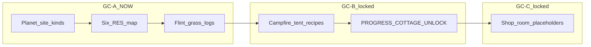

# Docs/22 — Gather & Craft implementation (GC)

| Field | Value |
|-------|-------|
| **Status** | **GC STRATEGY APPROVED**; **GC-A IN PROGRESS** (this PR); GC-B / GC-C locked |
| **Date** | 2026-09-21 |
| **Author** | Conductor (HomeWorld) |
| **Bible** | [GATHER_CRAFT_BIBLE.md](GATHER_CRAFT_BIBLE.md) · [GATHER_CRAFT_IMPL_PROMPT.md](GATHER_CRAFT_IMPL_PROMPT.md) |
| **Prior track** | [21_REAP_SOW.md](21_REAP_SOW.md) **CLOSED** — den/camp/special not primary RES miners |
| **Prefix** | **GC** — do **not** reuse RS / VP2 / D19 gate strings |

---

## Gate

Lead **`APPROVE GC STRATEGY`**, 2026-09-21 ET — **GRANTED** (chat: “approve GC strategy”). Unlocks **GC-A**.

**GC-A:** Lead **`APPROVE GC-A`** in chat — **not stamped in PR**. Unlocks **GC-B** (campfire + tent recipes + `PROGRESS:COTTAGE_UNLOCK`).

**GC-B:** Lead **`APPROVE GC-B`** — unlocks **GC-C** (placeholder shop/room volumes).

**Do not stamp phase APPROVED in a PR** — Lead types the gate string in chat.

---

## Goal

Ship the **Gather & Craft** demo spine from the locked bible: six `RES_*` only; planet day gather → store → named hearth recipes. This track splits implementation so craft/placeholders do not land before site mapping is proven.

---

## Tracks (Lead gates)

| Track | Name | Host | Status | Gate |
|-------|------|------|--------|------|
| **GC STRATEGY** | Bible + impl unlock | Lead | **APPROVED** | Lead **`APPROVE GC STRATEGY`**, 2026-09-21 ET |
| **GC-A** | Site→RES + flint/grass flavor | CLOUD+DESKTOP | **IN PROGRESS** | Lead **`APPROVE GC-A`** (after DESKTOP greps) |
| **GC-B** | Campfire + tent + cottage unlock | CLOUD+DESKTOP | **LOCKED** | Lead **`APPROVE GC-B`** |
| **GC-C** | Placeholder shop/room volumes | CLOUD+DESKTOP | **LOCKED** | Lead **`APPROVE GC-C`** |

---

### GC-A — Site→RES map + display flavor

**Goal:** Day/body gather on VS_MVP piles uses canonical site kinds; logs remain greppable `GATHER: RES_WOOD` / `RES_STONE` / `RES_FIBER` with optional `(flint)` / `(grass)` flavor lines.

| Site kind | Yield | Flavor (UI/log only) |
|-----------|-------|----------------------|
| `trees` | `RES_WOOD` | Wood |
| `rocks` | `RES_STONE` | **Flint** |
| `flowers` | `RES_FIBER`, alternate harvest `RES_HERB` | **Grass** (fiber) |
| berry nodes | `RES_BERRY` | Berry |
| seed pods | `RES_SEED` | Spirit seed |
| den / camp / special | [Docs/21](21_REAP_SOW.md) | Not primary six-RES miners |

| Item | Spec |
|------|------|
| **Code** | `EHomeWorldGatherSiteKind`, `AHomeWorldResourcePile::GatherSiteKind`, `homeworld_gc_site_setup.py` |
| **Placement** | `place_vs_mvp_rs_material_sites.py`, `place_vs_mvp_resource_piles.py` |
| **Handoff** | [handoffs/GC_A_SITE_RES.md](handoffs/GC_A_SITE_RES.md) |

**Done criteria (GC-A):**

- [ ] C++ maps site kinds to six `RES_*` (no 7th id)
- [ ] `GATHER: RES_WOOD` + `RES_STONE` + `RES_FIBER` from mapped day sites (DESKTOP PIE or scripted harvest)
- [ ] Optional `GATHER: RES_STONE (flint)` / `GATHER: RES_FIBER (grass)` flavor lines
- [ ] Lead **`APPROVE GC-A`** (chat) to unlock GC-B

---

### GC-B — Campfire + tent + cottage unlock (locked)

**Goal:** Named recipe costs at campfire; `PROGRESS:COTTAGE_UNLOCK` log/flag after demo loop. **Out of scope for GC-A PR.**

---

### GC-C — Placeholder shops/rooms (locked)

**Goal:** Enter volumes → `PLACEHOLDER:*` logs only; no functional shop craft. **Out of scope for GC-A PR.**

---

## Non-goals (GC-A PR)

| Out | Why |
|-----|-----|
| Craft recipes / campfire / tent | GC-B |
| Cottage unlock / placeholder shops | GC-B / GC-C |
| Combat, movement mantle | Other tracks |
| Bulk new `.uasset` / `.umap` | Docs/20 allowlist |

---

## Hard rules

| Rule | Source |
|------|--------|
| Exactly six `RES_*` | `Docs/canon/SCHEMA.md` |
| Flint/grass = display only | `GATHER_CRAFT_BIBLE` A1 |
| Extend harvest path — no parallel inventory | `HomeWorldResourcePile` / `NormalizeResourceId` |
| Den/camp/special stay Docs/21 | Not primary miners |
