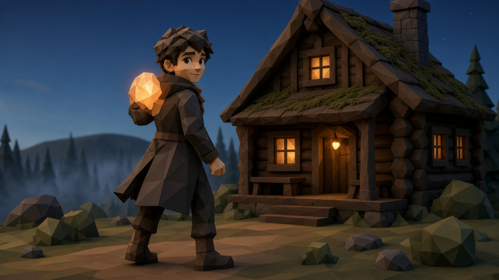
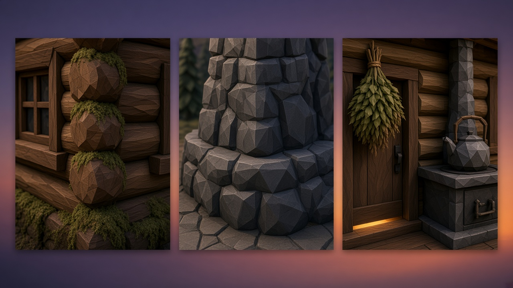
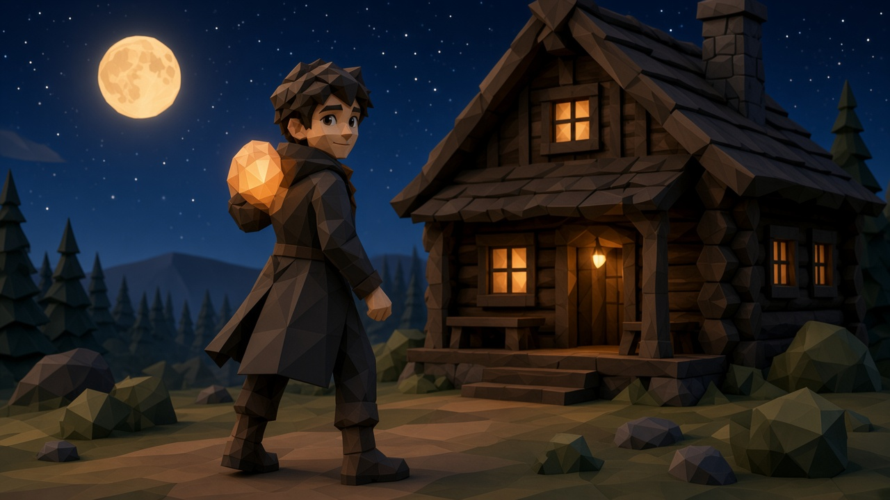
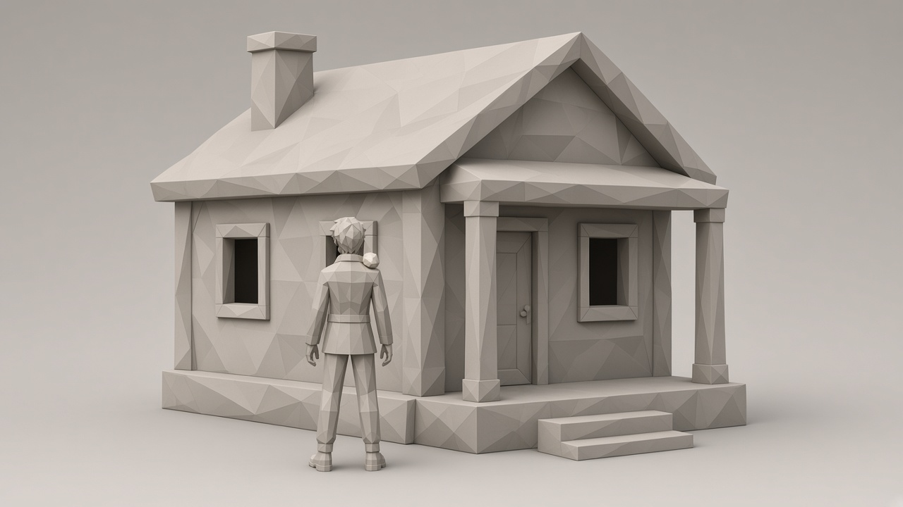
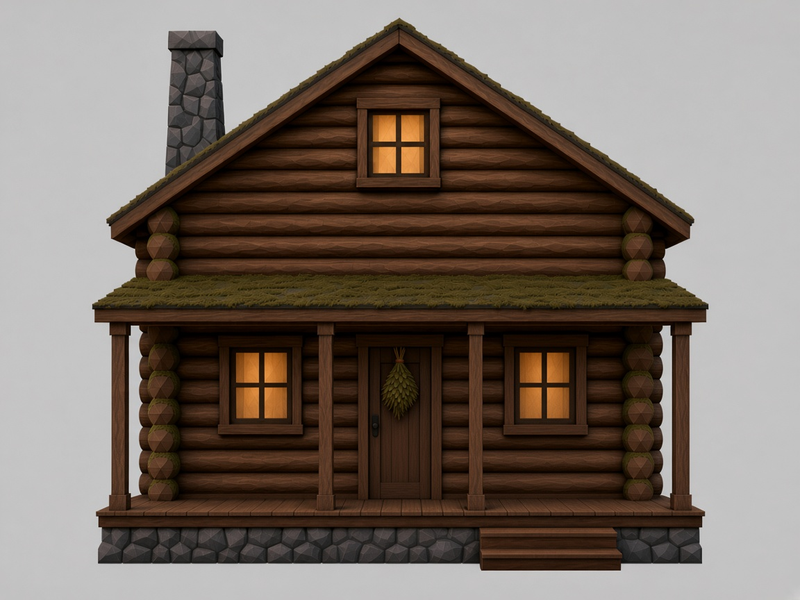
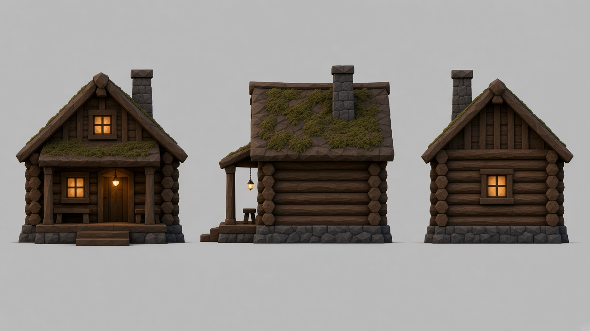

# Stills library

Support pictures for later AI meshes. Not meshes. Do not copy a file from here into `Content/`. Phase words are in [PHASES.md](PHASES.md). Kinds and order are in [STILL_GENERATION_STANDARD.md](STILL_GENERATION_STANDARD.md). A new file gets a row here before the next file is made. A picture stays in its place folder when its stage changes.

Order follows [PROTOTYPE_ASSET_TRACK.md](PROTOTYPE_ASSET_TRACK.md): homestead, descent and field, camp, barriers, lair last. One place, then stop for audit. Pack rules live in [../context/ART_BIBLE_CONTEXT.md](../context/ART_BIBLE_CONTEXT.md). One card per asset: [ASSET_CONTEXT_TASKS.md](ASSET_CONTEXT_TASKS.md).

## Player baseline

Kept 2026-10-10. Coat and shoulder spirit. The expression sheet locks the face. The scarf in that sheet is not the signifier.

| Still | Phase | Job |
|---|---|---|
| [SM_Player_body_texture_off.jpg](player/SM_Player_body_texture_off.jpg) | Greybox | Full body, texture off |
| [SM_Player_homestead_lookback.jpg](player/SM_Player_homestead_lookback.jpg) | Prototype | Looking back, homestead |
| [SM_Player_field_stand.jpg](player/SM_Player_field_stand.jpg) | Prototype | Standing, field |
| [SM_Player_camp_approach.jpg](player/SM_Player_camp_approach.jpg) | Prototype | Approaching camp |
| [SM_Player_spirit_form.jpg](player/SM_Player_spirit_form.jpg) | Prototype | Spirit form, asleep into spirit |
| [SM_Player_turnaround.jpg](player/SM_Player_turnaround.jpg) | Prototype | Front, side, back, three-quarter, one height. Kept 2026-10-10. |

## Homestead

Sitting lock, 2026-10-10. Place angles first: wide, close materials, night, texture-off massing. Partner and child are the next sitting, not this one.

Door plan, Greybox, already drawn: [SM_Home_Cabin_doors.png](cabin/SM_Home_Cabin_doors.png).

| Still | Phase | Job |
|---|---|---|
| [HS_Wide.jpg](homestead/HS_Wide.jpg) | Concept | Light. Kept 2026-10-10. Not the cabin’s size. |
| [HS_Materials.jpg](homestead/HS_Materials.jpg) | Concept | Close wood, stone, herb, kettle, and iron stove. Not size. |
| [HS_Night.jpg](homestead/HS_Night.jpg) | Concept | Same light at night. Body, not spirit. Not size. |
| [HS_Massing.jpg](homestead/HS_Massing.jpg) | Greybox | Earlier texture-off mass. Human-sized cabin. Not the shell. |
| [HS_Shell_greybox.jpg](homestead/HS_Shell_greybox.jpg) | Greybox | Shell for audit. Texture off. Bear beside the gabled mass. Small figure. |
| [HS_Cabin_front.jpg](homestead/HS_Cabin_front.jpg) | Prototype | Front elevation in audit. Side and back wait on a keep. |
| [HS_Turnaround.jpg](homestead/HS_Turnaround.jpg) | Prototype | Earlier front, side, and back. Not the current front. |

## Scale

Mood stills for `SCALE.md`. For audit. The close-assets north star is the dense pocket.

| Still | Phase | Job |
|---|---|---|
| [HS_Vista_scale.jpg](homestead/HS_Vista_scale.jpg) | Concept | First vista. Cabin still reads human-sized next to the player. |
| [HS_Vista_scale_v3.jpg](homestead/HS_Vista_scale_v3.jpg) | Concept | Cabin door towers over the player. The bear in this frame is still too small for the wild module. |
| [HS_Vista_bear_module.jpg](homestead/HS_Vista_bear_module.jpg) | Concept | Player is small. Round hut and a green bear. Not the kept cabin or bear. |
| [HS_Vista_bear_module_v2.jpg](homestead/HS_Vista_bear_module_v2.jpg) | Concept | Kept cabin and moss-bear, player still small. Pines are one height. |
| [HS_Vista_bear_module_v5.jpg](homestead/HS_Vista_bear_module_v5.jpg) | Concept | Harder bear facets, gabled cabin, player small. Pines still one height. |
| [HS_Vista_bear_module_v6.jpg](homestead/HS_Vista_bear_module_v6.jpg) | Concept | Pines at short, cabin-height, and above the roof. Bear and ground left the dusk look. |
| [HS_Vista_bear_module_v7.jpg](homestead/HS_Vista_bear_module_v7.jpg) | Concept | v5 cabin and player, original moss-bear. Pines are one height. |
| [HS_Vista_bear_module_v9.jpg](homestead/HS_Vista_bear_module_v9.jpg) | Concept | Earlier size keep. Bear towers over the cabin. Superseded by the 15 ft wall lock. |
| [HS_Vista_dim.jpg](homestead/HS_Vista_dim.jpg) | Concept | Dimension pass. Bear still taller than the wall. For audit. |
| [HS_Cabin_gap.jpg](homestead/HS_Cabin_gap.jpg) | Concept | Earlier gap keep. Bear towers over the cottage. |
| [HS_Cabin_gap_dim.jpg](homestead/HS_Cabin_gap_dim.jpg) | Concept | Dimension pass. Player at the door. Bear still taller than the wall. For audit. |
| [Lair_mouth_mood.jpg](lair/Lair_mouth_mood.jpg) | Concept | First mouth. Kneeling giant, no bull lane. |
| [Lair_mouth_mood_v3.jpg](lair/Lair_mouth_mood_v3.jpg) | Concept | Bull and giant share one cave. Too small. Does not lock size. |
| [Lair_back_ride_v2.jpg](lair/Lair_back_ride_v2.jpg) | Concept | Giant scale is right. Bull and rider are too big. |
| [Lair_back_ride_v3.jpg](lair/Lair_back_ride_v3.jpg) | Concept | Scale keep, 2026-10-10. Giant, small bull and rider, cliff and ocean. The snake is not kept. |
| [Lair_back_ride_v4.jpg](lair/Lair_back_ride_v4.jpg) | Concept | Snake laid along the slope. Not the wrap. |
| [Lair_back_ride_v5.jpg](lair/Lair_back_ride_v5.jpg) | Concept | Lair scale keep, 2026-10-10. Giant, small bull and rider, snake on the chest and neck, cliff and ocean. |

## Field

| Still | Phase | Job |
|---|---|---|
| [Field_bull_scale_v2.jpg](field/Field_bull_scale_v2.jpg) | Concept | Earlier bull keep. Shoulder reads larger than a 15 ft wall. |
| [Field_bull_dim.jpg](field/Field_bull_dim.jpg) | Concept | Dimension pass. Bull beside the player. Shoulder still high for a 15 ft wall. For audit. |

## Later

Camp and the barriers have no still pack yet. Do not generate them in this sitting.
