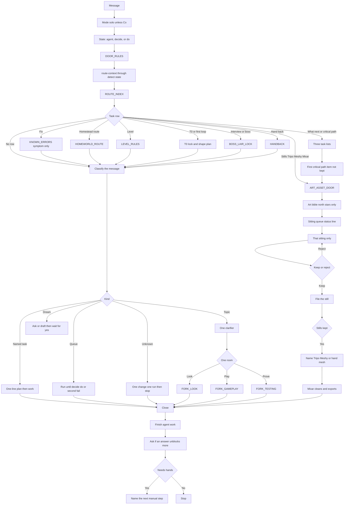

# Session start flow

The door as written in `Docs/context/SESSION_START.md`. This picture is not a second door. Production is `## Pick the task`: vision Shape, then the three critical-path status lines, then one room.

Look is art and asset. Play and Prove are the other two rooms. There is no fourth craft room.
