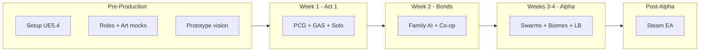

# HomeWorld Roadmap Overview

Single place for the home team to track phases, owners, and approval gates. This distills the GDD into what happens when, who touches what, and how it ties to the 7 pillars and 8–12 hour campaign.

---

## GDD Snapshot (Chopped)

| Area            | Summary                                                                                                                                  |
| --------------- | ---------------------------------------------------------------------------------------------------------------------------------------- |
| **Core loop**   | Day: build/nurture/explore → Night: family defends → Realm-hop for loot/heirs. Co-op 2–8p with role synergy (Protector / Healer / Home). |
| **Campaign**    | Act 1 solo (2–3h) → Act 2 duo (3–4h) → Act 3 full co-op (3–5h+). Teaches combat → bonds → dynasty.                                       |
| **Tech**        | UE5.4+, PCG biomes, GAS combat, Day/Night, Mass or Epic’s replacement for swarms, Steam sessions + optional GameLift. ~$0–150 (templates).                 |
| **North stars** | Nurturing bonds, Protector mastery, Whimsical realm-hop, Day–night legacy, Co-op synergy, Prestige leaderboards, Meaningful progression. |

---

## Roadmap Phases (High Level)

---

## Phase 0: Pre-Production (Before Week 1)

- **Everyone:** Install UE5.4+; enable PCG, GAS. Download same template (e.g. Open World + World Partition).
- **Budget lock:** Confirm ~$0 (free) vs up to ~$150 (e.g. Advanced ARPG Template, SteamLead). Time = main cost.
- **Roles:** Designer (loops/missions), Artist (mocks/whimsical style), Programmer (GAS/AI/PCG), Tester (PIE/multiplayer).
- **Deliverables:** One-pager prototype vision; art mocks for one biome + character tone; Week 1 owner (e.g. Programmer leads first playable).

**Approval gate:** Vision/theme + pillars locked; campaign flow + mission count agreed; tech feasible; team commits to Week 1.

---

## Phase 1: Week 1 – Act 1 (Pillars 2, 3, 7)

- **Focus:** Lone Wanderer – crash, scout, fight, claim home. Solo only.
- **Tech:** PCG forest biome, GAS combat (3 skills), proc-gen realms, basic building. Free assets (e.g. FAB survival char, Quixel).
- **Art/Story:** Whimsical concept art; emotional beat: isolation → determination.
- **Success:** Playtest “survive 3 missions” (crash → scout → boss → claim home).

**Roadmap line:** First playable loop: explore → fight → build. No family/co-op yet.

---

## Phase 2: Week 2 – Bonds + Act 2 (Pillars 1, 5 + Act 2)

- **Focus:** Forged Bond – rescue partner, build home, first night defense. Duo co-op.
- **Tech:** Relationship/needs (dialogue, GAS for needs); family AI (Behavior/State Trees); Steam sessions for 2p.
- **Art/Story:** Partner character + dialogue; vulnerability → loyalty.
- **Success:** Duo playtest: build together, defend one night, roles (e.g. Protector loots, Healer buffs).

**Roadmap line:** Co-op and “nurturing bonds” enter the loop; Act 2 mission set (rescue → build → defend) defined.

---

## Phase 3: Weeks 3–4 – Alpha / Act 3 (Pillars 4, 6 + Act 3)

- **Focus:** Dynasty Rising – expand realms, raise heir, endgame portals; swarms + leaderboards.
- **Tech:** Day–night sequencer + PCG spawns; Mass or Epic’s replacement for night swarms (scale with family); second biome (e.g. sand/crystal); leaderboards (Steam API or SteamLead).
- **Art/Story:** Heir/home themes; strength → legacy.
- **Success:** Clan raid (2–8p) + “Best Homes” leaderboard playtest (family size × happiness + clears).

**Roadmap line:** Full 8–12h campaign shape: Act 1 (solo) → Act 2 (duo) → Act 3 (full co-op + prestige). Alpha = feature-complete for EA scope.

---

## Phase 4: Post-Alpha → Steam Early Access

- **Scope:** Bug fix, performance (100+ FPS mid-PC, LODs), onboarding polish. No new pillars.
- **Launch:** Steam EA (Enshrouded-style): 8–12h campaign + endgame loops (realm-hop, prestige, leaderboards).
- **Post-launch:** Iterate on leaderboards, clan tools, and “Best Homes” contests from feedback.

---

## Roadmap at a Glance

| Phase      | Duration  | Main outcome                                  | Pillars |
| ---------- | --------- | --------------------------------------------- | ------- |
| Pre-prod   | Before W1 | Vision + roles + prototype + art mocks        | —       |
| Week 1     | 1 week    | Act 1 playable (solo, 3 missions)             | 2, 3, 7 |
| Week 2     | 1 week    | Act 2 playable (duo, build/defend)            | 1, 5    |
| Weeks 3–4  | 2 weeks   | Alpha (swarms, 2 biomes, leaderboards, Act 3) | 4, 6    |
| Post-alpha | TBD       | Steam EA build                                | All     |

---

## What “Chopped” Means Here

- **Campaign** drives content: each week maps to an Act and its emotional beat.
- **Pillars** drive scope: no week adds every pillar; Week 1 = combat/explore/progression, Week 2 = bonds/co-op, Week 3–4 = day–night/competition.
- **Tech** is staged: PCG + GAS first, then family AI + Steam, then Mass (or Epic’s replacement) + leaderboards.
- **Approval checklist** = gate before Week 1; same checklist can be reused at end of Week 2 and Week 4 for go/no-go to next phase.
