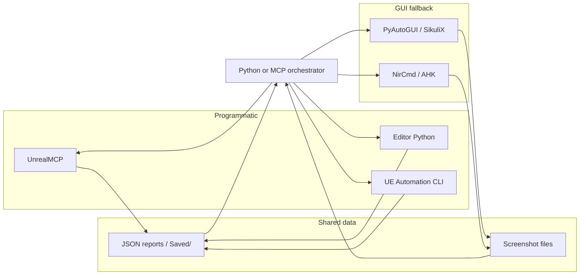

# Full development automation — research summary

This doc captures research on third-party and first-party tools for **fully automating** the development process: programmatic access (Unreal Python, MCP, Automation Framework), GUI automation (key clickers, screenshotters, image-based clicking), and orchestration so the stack can reach every part of the program. For Editor UI or flows that have no API, GUI automation tools provide a fallback.

---

## 1. Purpose

- **Goal:** Full automation of dev, testing, and debugging using **programmatic access where available** and **GUI automation** (screenshots, key/mouse, image recognition) where the Editor does not expose an API.
- **Data flow:** Tools pass information via **JSON** (e.g. `Saved/`, `ReportExportPath`, MCP request/response) and **screenshot files** so an orchestrator (Python script or MCP-agent) can chain steps and make decisions.
- **Scope:** One place for “everything we could use”; implementation phases (orchestrator, image-based flows) are separate follow-up work.

---

## 2. Tool catalog

### 2.1 Unreal Engine–native (programmatic)

| Tool / API | Purpose | Data flow / orchestration |
|------------|---------|---------------------------|
| **UE Automation Framework** (UE 5.7) | Run tests from CLI: `-ExecCmds="Automation RunTest Group:MyGroup;Quit"`, `-ReportExportPath="<path>"` for JSON/HTML. | JSON reports to disk; CI or scripts parse and act. |
| **Gauntlet** | Run UE sessions (Editor/Client) for tests; no game code required. | Session Frontend; configs and artifacts. |
| **Screenshot Comparison Tool / Functional Screenshot Test Actor** | In-engine screenshot capture and comparison; tolerance, delay, disable noisy features. | Session Frontend; screenshot history and diffs. |
| **Unreal Frontend (UFE)** | Package/deploy and run Client tests without Editor. | Build/test artifacts. |
| **Editor Python API** | Asset/level/actor control, `ExecutePythonScript`; run from Editor or CLI. | Scripts; MCP or harness calls scripts and reads `Saved/` outputs. |
| **Slate / UICommandsScriptingSubsystem** | Programmatic Slate/UI commands from Python (UE 5). | Python scripts; limited vs full UI. |

References: Epic UE 5.7 — [Run Automation Tests](https://dev.epicgames.com/documentation/en-us/unreal-engine/run-automation-tests-in-unreal-engine), Gauntlet, Screenshot Comparison Tool, [Scripting the Editor Using Python](https://dev.epicgames.com/documentation/en-us/unreal-engine/scripting-the-unreal-editor-using-python).

### 2.2 MCP and Editor control (orchestration)

| Tool | Purpose | Data flow |
|------|---------|-----------|
| **UnrealMCP** (existing in project) | Expose Editor to Cursor/agents: execute Python, console commands, actor/Blueprint ops. | MCP request/response; [Content/Python/mcp_harness.py](../Content/Python/mcp_harness.py), `Saved/mcp_response.json`. |
| **MCP-agent / Orchestrator** | Planner–worker patterns, DAG, event-driven workflows. | Chain MCP tools (Unreal + browser + shell) in one pipeline. |

Use: UnrealMCP for everything it can do; MCP orchestration for multi-step flows that mix Editor + GUI automation + CI.

### 2.3 GUI automation (when Editor has no API)

| Tool | Purpose | Data flow / notes |
|------|---------|-------------------|
| **PyAutoGUI** | Mouse, keyboard, screenshots, `locateOnScreen()` (image find). | Python; Pillow + optional OpenCV; coordinates or image refs. |
| **SikuliX** | Image-based “click this PNG” automation; Jython. | `.sikuli` dirs (script + PNGs); good for Editor UI when no API. |
| **AutoHotkey v2** | Windows hotkeys, send keys, ImageSearch, window management, screenshots (e.g. GDI+). | Scripts; call from Python/CI via `subprocess` or `os.startfile`. |
| **NirCmd** | CLI: `savescreenshot`, `sendkeypress`, `script` for batch. | Subprocess; simple orchestration from Python or batch. |
| **RPA.Desktop (Robocorp)** | Keyboard, mouse, screenshots, image/OCR locators in Robot Framework. | Keywords; integrates with RPA pipelines. |
| **Windows UI Automation (UIA)** / **Accessibility Insights** | Control by accessibility tree (no pixels). | Good if Editor exposes UIA; varies by UE/version. |

Use: PyAutoGUI or SikuliX for “screenshot → find button → click” when Python/MCP cannot do it; NirCmd/AHK for lightweight key/screenshot from scripts.

### 2.4 Screenshot and visual comparison

| Tool | Purpose | Data flow |
|------|---------|-----------|
| **UE Functional Screenshot Test Actor** | In-engine capture + comparison, tolerance. | Session Frontend; baseline vs run. |
| **pixelmatch / jest-image-snapshot** | Pixel diff and thresholds. | Node/Python; compare screenshots from PyAutoGUI or UE. |
| **Perceptual hashing / SSIM** | “Looks similar” vs pixel-perfect. | Reduce false positives from GPU/AA. |

Use: UE for in-engine tests; pixelmatch/jest-image-snapshot for screenshots taken by PyAutoGUI/Sikuli/NirCmd of Editor or game window.

### 2.5 Orchestration and CI

| Tool | Purpose | Data flow |
|------|---------|-----------|
| **UET (Redpoint)** | Build + run UE automation from CLI; parallel runs, retries, BuildGraph. | `uet test -e 5.5`; JSON/output; CI. |
| **Horde** (Epic) | Enterprise BuildGraph, distributed agents, Perforce. | For large teams; not required for single-dev. |
| **Python orchestrator** | `subprocess` / `os.startfile` for Editor; wait/delay then PyAutoGUI/NirCmd; read JSON from `Saved/` or `ReportExportPath`. | One script or Makefile: UE CLI → parse report; or start Editor → wait → GUI automation → screenshot → compare. |
| **MCP + Cursor** | Agent uses Unreal MCP + shell + browser MCP in one thread. | Same chat: “run test,” “click Play,” “screenshot viewport” via tools. |

Use: Python + UET or raw UE CLI for tests; Python + PyAutoGUI/NirCmd for “start Editor, drive UI, capture result”; MCP for interactive agent-driven runs.

---

## 3. Information flow between tools

- **Orchestrator** (Python script or MCP-agent): decides step (e.g. “run test” vs “drive Editor UI”).
- **Programmatic:** MCP, Editor Python, UE CLI write results to `Saved/`, `ReportExportPath`, or MCP response JSON.
- **GUI fallback:** PyAutoGUI/SikuliX/NirCmd send keys and take screenshots; orchestrator reads screenshot files or passes paths to pixelmatch.
- **Shared data:** JSON and screenshot paths are the contract between tools (e.g. harness request/response, `pie_test_results.json`, automation report).

---

## 4. Orchestration patterns

1. **Python script:** Start Editor (e.g. `os.startfile` or `subprocess` without blocking) → wait for load → run PyAutoGUI/NirCmd sequence (keys, clicks, screenshots) → save screenshot to known path → optionally compare with pixelmatch or baseline.
2. **CI:** Run UET or `UnrealEditor.exe ... -ExecCmds="Automation RunTest ...;Quit" -ReportExportPath="<path>"` → parse JSON report → fail build on test failures.
3. **Agent (MCP + Cursor):** Use Unreal MCP tools for Editor actions; for steps MCP cannot do (e.g. specific Editor menu with no API), invoke or document a GUI-automation step (PyAutoGUI/Sikuli script or NirCmd) and read result from `Saved/` or screenshot path.

---

## 5. Tool choices for HomeWorld

- **Keep:** UnrealMCP + Editor Python + existing harness scripts (`mcp_harness.py`, `pie_test_runner.py`) and `Saved/` JSON convention.
- **Add when needed:** PyAutoGUI for Editor UI fallback (screenshot + locate + click); NirCmd or AutoHotkey for lightweight key/screenshot from scripts.
- **Regression:** UE Automation + `-ReportExportPath` for automated test runs; optionally UET for parallel runs and retries.
- **Later:** SikuliX or PyAutoGUI image-based flows for specific high-value, non-API Editor steps (document which steps and why in task docs or KNOWN_ERRORS).

---

## 6. Implementation (Phase 2)

Host-side scripts run from the project root (no Editor required for the automation runner).

### 6.1 run_ue_automation.py

- **Purpose:** Run UE automation from the command line and parse the report so CI or an agent can pass/fail without opening the Editor.
- **Run:** From project root: `py Content/Python/run_ue_automation.py`. Requires **UE_EDITOR** env set to the UnrealEditor.exe path. Optional: **HOMEWORLD_PROJECT** for the project directory (defaults to current working directory).
- **Outputs:** `Saved/automation_run_result.json` with `success`, `passed`, `failed`, `report_path`, `error`; exit code 0 when all tests pass, 1 otherwise.
- **Report format:** UE writes reports to the directory passed as `-ReportExportPath`; the script looks for `index.json` (or any `.json`) and reads `succeeded` / `failed` counts. See Epic UE 5.7 [Run Automation Tests](https://dev.epicgames.com/documentation/en-us/unreal-engine/run-automation-tests-in-unreal-engine) and [Review Test Results](https://dev.epicgames.com/documentation/en-us/unreal-engine/review-test-results-in-unreal-engine) for report layout.
- **CLI:** `--group Smoke` (default) to choose test group; override for other groups.

### 6.2 capture_editor_screenshot.py (optional)

- **Purpose:** Capture a screenshot of the screen (or foreground) to a known path for visual checks or debugging when MCP/Editor Python is not enough.
- **Run:** From project root: `py Content/Python/capture_editor_screenshot.py`. **Optional dependency:** `pip install pyautogui` (and Pillow).
- **Outputs:** `Saved/screenshot_result.json` with `success`, `path`, `error`; image file at `Saved/screenshots/capture_<YYYYMMDD_HHMMSS>.png`. If PyAutoGUI is not installed, the script exits with code 1 and a message to install it.

---

## 7. Automation cycle state and task list

When running the **automatic development cycle** (desires → task list → implement → test → debug → finalize → update rules), the agent uses two files so it can resume and avoid infinite loops.

**Task list:** [docs/workflow/CYCLE_TASKLIST.md](workflow/CYCLE_TASKLIST.md) — Ordered list of tasks. Each task has: **id**, **goal**, **success criteria**, optional **doc** link, **status** (`pending` | `in_progress` | `completed` | `blocked`). Created when the cycle starts; updated each time a task is started or completed.

**Cycle state:** [docs/workflow/CYCLE_STATE.md](workflow/CYCLE_STATE.md) — **current_task_index** (which task), **retry_count** (failures for current task), **last_error_summary** (short fingerprint for same-failure guard), **last_outcome** (`pass` | `fail` | `blocked`), **blocked_reason** (when blocked). Read at start of each iteration; updated after test/debug/finalize. Loop guards: max 3 retries per task; if `last_error_summary` unchanged after retry, count as no-progress — after 2 no-progress attempts, agent must try a different approach or mark blocked. Before retry, agent must state what changed (hypothesis, fix, or research).

**How to start:** Use the **start-automation-cycle** command (in Cursor: invoke the command and provide desires in the message). Or use the kickoff prompt: *"Start the automatic development cycle. Desires: [paste your feature goals or e.g. Days 11–13 from the schedule]. Generate the task list, write it to docs/workflow/CYCLE_TASKLIST.md, init CYCLE_STATE, and run the cycle for the first task."* To run the next task or retry: *"Continue the automatic development cycle."* The agent follows [.cursor/rules/19-automation-cycle.mdc](../.cursor/rules/19-automation-cycle.mdc) when the cycle is active.

---

## 9. Orchestrator (run_automation_cycle.py)

Host-side script [Content/Python/run_automation_cycle.py](../Content/Python/run_automation_cycle.py) orchestrates build, Editor lifecycle, and optional tests. Run from project root: `py Content/Python/run_automation_cycle.py [options]`. Requires **UE_EDITOR** env; optional **HOMEWORLD_PROJECT**.

**Lifecycle:**
- **Build:** Runs `Build-HomeWorld.bat` from project root; parses `Build-HomeWorld.log` for "Exit code: 0". Fails if Editor is running (Live Coding conflict); use `--close-editor` first to send graceful taskkill.
- **Editor launch:** `--launch-and-wait` starts UnrealEditor with `-UNATTENDED`, then waits for **port 55557** (MCP) with timeout (default 300 s) and writes `Saved/cycle_editor_ready.json`. Agent or MCP client can then drive the Editor.
- **Close:** `--close-editor` sends `taskkill /im UnrealEditor.exe` **without** `/f` (graceful WM_CLOSE). Use before build or when switching to headless runs.

**Modes:**
- **Headless:** Use `--scripts script1.py script2.py` to run each via `-ExecutePythonScript` (Editor starts, runs script, exits per script). Or use `--task N` with [automation_cycle_config.json](../Content/Python/automation_cycle_config.json) mapping task id to script list.
- **MCP:** Use `--launch-and-wait` so the agent can connect via MCP after port is ready; when done, run with `--close-editor` or close manually.

**Cycle integration:** With `--task N`, the orchestrator loads scripts from config (if any), runs build → scripts → `run_ue_automation.py`, writes `Saved/cycle_run_result.json`, and updates `docs/workflow/CYCLE_STATE.md` (current_task_index, last_outcome).

---

## 10. GUI automation (PCG and no-API steps)

**Editor-driven GUI automation:** Open the Editor, use an auto-clicker (PyAutoGUI) with reference images to navigate and click the right UI elements in order; optionally take screenshots to validate. Use this when no API exists or when it is the better solution (e.g. faster than a commandlet, or commandlet not yet implemented). Orchestration: the loop auto-launches the Editor when UE_EDITOR is set (or run launch-and-wait manually), run MCP/Python to put the Editor in the right state (level/asset open), run the host-side GUI script (ref-based clicks), read result JSON. See [AUTOMATION_READINESS.md](AUTOMATION_READINESS.md) (Rare / one-time human intervention).

For steps that have no Python/MCP API (see [PCG_VARIABLES_NO_ACCESS.md](PCG_VARIABLES_NO_ACCESS.md)), use a **GUI automation** script: PyAutoGUI (or SikuliX) to focus the Editor, open the PCG graph, set Get Landscape Data (By Tag), assign mesh list, assign graph to volume, click Generate. Reference PNGs in `Content/Python/gui_automation/refs/` (capture once via `capture_pcg_refs.py`); result in `Saved/gui_automation_result.json`. Script: `Content/Python/gui_automation/pcg_apply_manual_steps.py`. Document in PCG_VARIABLES_NO_ACCESS when to run it (e.g. "if golden graph not yet done").

---

## 11. References

| Topic | URL |
|-------|-----|
| Run Automation Tests (UE 5.7) | https://dev.epicgames.com/documentation/en-us/unreal-engine/run-automation-tests-in-unreal-engine |
| Gauntlet | https://dev.epicgames.com/documentation/en-us/unreal-engine/gauntlet-automation-framework-in-unreal-engine |
| Screenshot Comparison Tool (UE 5.1) | https://dev.epicgames.com/documentation/en-us/unreal-engine/screenshot-comparison-tool-in-unreal-engine |
| Scripting the Editor Using Python (UE 5.7) | https://dev.epicgames.com/documentation/en-us/unreal-engine/scripting-the-unreal-editor-using-python |
| PyAutoGUI | https://pyautogui.readthedocs.io/ |
| SikuliX | https://www.sikulix.com/ |
| AutoHotkey v2 | https://www.autohotkey.com/docs/v2/ |
| NirCmd | https://www.nirsoft.net/utils/nircmd.html |
| UET (Redpoint) | https://github.com/RedpointGames/uet |
| RPA.Desktop (Robocorp) | https://robocorp.com/docs/libraries/rpa-framework/rpa-desktop/keywords |
| MCP-agent orchestrator | https://docs.mcp-agent.com/workflows/orchestrator |
