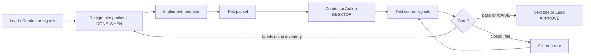

# One-shot bites — Conductor board workflow

**Schema before data.** This doc defines how big Unreal / environment / capture / prototype asks are **sliced into one-shot chunks** the Conductor can run on the board. It is the **Design** artifact for the **HomeWorld Co bot-company track workflow**: **Design → Implement → Test → Fix** (sidebar owners + Conductor parent). Do **not** call this workflow a “PDF cycle” in packets or handoffs — use **bot-company track** or **Design–Implement–Test–Fix loop**; stage mechanics live in [swarm/PDF_CYCLE.md](../../swarm/PDF_CYCLE.md) as a companion only.

**Evidence inheritance:** Every bite inherits [CAPTURE_REDUNDANCY.md](CAPTURE_REDUNDANCY.md) § **Procedure-agnostic evidence protocol** (pre-evidence DONE-WHEN; artifacts **confirm**, not **discover**; score real signals; one Fix root after research).

**Related:** [HARNESS_ARRANGE_TASKLIST.md](HARNESS_ARRANGE_TASKLIST.md) · [Docs/33_PLACEMENT_STILLS.md](../../Docs/33_PLACEMENT_STILLS.md) (PS track instance) · [swarm/SWARM_OPS.md](../../swarm/SWARM_OPS.md) (Conductor law).

---

## Prove-size / one-shot ladder (Test lock-in — any track)

HomeWorld **Test** locked prove sizing for Conductor Act on **every** track (PS, PA-E-style capture, env iteration, harness). Wording is normative for packets and board rows.

| # | Rule | Requirement |
|---|------|-------------|
| 1 | **Bite = one closed DONE-WHEN** | One bite closes **one** DONE-WHEN — e.g. **one label**, **one cam**, or **one metric** — **not** a full 7-still scene until **CAP+CAM** (capture path + camera aim contract) are green on a minimal slice. |
| 2 | **Pre-Act** | That bite’s labels must be **⊆ inventory ∩ Arrange actors** in the **loaded** level, or **block** — **no Act**. |
| 3 | **PASS** | Score **Act-window `mtime` + `bytes`** (never exists-only). **Black + file** ⇒ **`soft_fail`**; **missing setup** (labels, Arrange, gate) ⇒ **`closed_fail`**. |
| 4 | **Ladder** | **1-cam green → N-cam set → full PS-C** (or track equivalent). **No whole-scene Act** while per-item defects stay open (e.g. **CAP-001** capture path, **CAM-002** aim — or track-specific IDs on the Test packet). |

**Post–PR #198:** If **deepen** / extended research is still **red** (inconclusive or open tooling gap), Conductor **prefers one-cam Act first** before widening to N-cam or full-scene prove — same ladder, smaller Act surface ([UE_BIBLE.md](../../Docs/UE_BIBLE.md) §2b one-cam minimal repro aligns with this row).

---

## Purpose / hosts

| Host | Owns | Typical one-shot work |
|------|------|------------------------|
| **CLOUD** | Docs, PRs, schema, inventory JSON **specs**, task packets, merge | Design bite definitions; Implement when path is `docs/` or `Docs/` only |
| **DESKTOP** | Conductor parent: Editor, MCP, PIE, prove scripts, `Saved/` artifacts | Implement (UE/Python), Test **Act** (run harness), score returned evidence |
| **Lead** | **`APPROVE *`** gates, taste/framing, track open/close, WAIVE | PS-D-style eyeball; refuses scope creep; no invented product tracks |

**Division of labor:**

- **Design** (CLOUD or sidebar HomeWorld Design) writes **one-shot packets**: named risk, DONE-WHEN math, label subset, single artifact class, host column, outcome mapping.
- **Implement** ships **exactly one bite** per lap (paths on packet only).
- **Test** scores **named signals** from returned artifacts; does not fix product code.
- **Fix** touches **one root cause** per lap (defect-linked paths); **no new cameras**, no new product track, no re-Design without Conductor re-packet.
- **Conductor** schedules bites on the board, refuses bad handoffs, runs DESKTOP Act, and does not self-stamp Lead gates ([docs/human-use/OWNERSHIP.md](../human-use/OWNERSHIP.md)).

Cloud agents **return** PRs and evidence paths; they do not substitute for DESKTOP prove ([WINDOWS_BRIDGE.md](../Setup/WINDOWS_BRIDGE.md)).

---

## Failure modes

How teams fail when dividing UE / env / capture / prototype work — patterns from vertical-slice practice, studio “replaceable take” pipelines, and Epic/community capture threads (HighResShot / AutomationLibrary / MRQ).

### Scope as miniature full game

Packing an entire Act (multi-biome dress, full camera grid, metrics **and** stills **and** harness refactor) into one Conductor row produces unbounded Fix loops and ambiguous PASS. Industry vertical-slice guidance: **one provable claim per lap** (proof density), not a slice-shaped milestone disguised as a task.

### Discovery via screenshots instead of Arrange math

Running capture to **find** missing actors, wrong TOD, or void aim treats PNGs as inventory probes. That inverts the harness order in [CAPTURE_REDUNDANCY.md](CAPTURE_REDUNDANCY.md) (Arrange gate, testing preconditions). **Arrange math** (look-at centroid, dress AABB, frozen TOD/light numbers) must be **DONE-WHEN before Act**; stills **confirm** placement/lighting intent afterward.

### Horizontal polish before pipeline proven

Hero materials, Nanite, Lumen tuning, or taste-led composition passes before **one** capture path scores **`pass`** on real signals (gate JSON + bytes/metrics) wastes DESKTOP time. Prove **replaceable take** mechanics first (Fortnite-style: swap content behind a frozen camera/light contract once the pipeline is green).

### Async capture races

Epic and forum patterns for Editor stills converge on: **one capture request per Slate tick** (`AutomationLibrary.take_high_res_screenshot`); **do not** stack multiple HighResShot/console invokes while the prior async job is in flight; **gate before flush** (Arrange `ready: true`, loading finished when API exists); **score existence-only** (PNG on disk without mtime/bytes/luminance/metrics) yields false PASS. Blocking `sleep` on the main thread while waiting for capture starves ticks (MCP “Not Responding”) — use tick-driven waits per CAPTURE_REDUNDANCY § Shotlist wait policy.

### Missing inventory ∩ world pre-Act

Acting on label lists that were never verified in the **loaded** level causes closed_fail churn or soft_fail misread as “automation broken.” Required actor labels must be **⊆ Design inventory ∩ in-world query** before Implement declares Implement done.

### Inventing new cams mid-Fix

Fix laps that add `CAM_*` / `PS_*` actors to “frame better” are Design scope. Fix is **defect-linked** only; camera gaps bounce to **Design** with a new one-shot, not a silent Fix edit.

### Host confusion

| Symptom | Failure |
|---------|---------|
| CLOUD agent claims DESKTOP PASS from docs alone | No prove |
| DESKTOP runs taste framing as `ok: true` | Metric ≠ visual violated |
| Lead eyeball before metrics green | Wrong gate order for PS-C vs PS-D |
| Test “fixes” Python in Fix’s paths | Ownership violation |

---

## Bite criteria

**DONE-WHEN checklist** — Conductor may schedule a row only when the packet satisfies **all** rows **and** [Prove-size / one-shot ladder](#prove-size--one-shot-ladder-test-lock-in--any-track).

| # | Criterion | Required content |
|---|-----------|------------------|
| 1 | **One named risk** | Single sentence: what fails if this bite slips (e.g. “cliff underside float undetected”). |
| 2 | **One closed DONE-WHEN** | **One** label, **one** cam, **one** metric, or **one** gate field family per bite — not multi-cam / multi-metric bundles until ladder step allows (see § Prove-size ladder). |
| 3 | **One DONE-WHEN math set** | Frozen numbers Design owns: look-at target(s), dress **AABB** or anchor envelope, TOD phase + preset IDs, key light/exposure cvars — copied into inventory + Arrange sidecar **before** Implement. |
| 4 | **Pre-Act: labels ⊆ inventory ∩ Arrange** | Explicit label list; DESKTOP verify **Arrange actors** present — else **block Act** (no capture/metrics run). |
| 5 | **Exactly one Act artifact class** | Choose **one**: `stills` **OR** `metrics JSON` **OR** `arrange/harness gate JSON` **OR** `docs/handoff only` — not multiple primary classes in the same bite. |
| 6 | **Score signals named** | Act-window **`mtime` + `bytes`** (never exists-only); gate JSON fields; metric IDs; **`soft_fail`** vs **`closed_fail`** per ladder rule 3. |
| 7 | **Host column** | `CLOUD` \| `DESKTOP` \| `Lead` per stage on the packet. |
| 8 | **Outcome mapping** | How `pass` / `soft_fail` / `closed_fail` / Lead-later apply ([CAPTURE_REDUNDANCY.md](CAPTURE_REDUNDANCY.md) three-state + PS metric vs visual split). |
| 9 | **Ladder step** | Which rung: **1-cam** \| **N-cam set** \| **full track prove**; open CAP/CAM (or track) defects forbid whole-scene Act. |

**Template (fill before Implement):**

```yaml
bite_id: "{TRACK}-{slug}"
prove_size: one_label | one_cam | one_metric | one_gate_family  # one closed DONE-WHEN
ladder_step: 1_cam | n_cam_set | full_track_prove
open_defects_block_whole_scene: []   # e.g. CAP-001, CAM-002
risk: ""
done_when_math:
  look_at: []          # actor or bounds id + centroid rule
  aabb: {}             # dress envelope or per-actor bands
  tod_light: {}        # phase, preset, stack verify ids
labels_required: []
artifact_class: stills | metrics | gate | docs
score_signals:
  paths: []
  fields: []
  mtime_bytes_window: optional
hosts:
  design: CLOUD
  implement: CLOUD | DESKTOP
  test_act: DESKTOP
  lead: Lead | —
outcomes:
  pass: ""
  soft_fail: ""
  closed_fail: ""
  lead_later: ""
```

---

## HomeWorld digest → one-shot loop

Conductor board loop for the **bot-company track** (four sidebar stages + parent). **Not** the quarantined pre-swarm [AGENT_COMPANY.md](AGENT_COMPANY.md) loop.



| Step | Owner | Rule |
|------|-------|------|
| 1 | Lead / Conductor | Names the **big ask** and track id; does **not** open new product tracks without Lead. |
| 2 | Design | Decomposes into **one-shots** with bite criteria table complete; writes handoff paths under `Docs/handoffs/` when track is MVP canon. |
| 3 | Implement | Ships **one** bite; exclusive paths on packet. |
| 4 | Test | Publishes Test packet (checklist + signal names); no DESKTOP execution in sidebar Test on cloud-only hosts. |
| 5 | Conductor | **Act** on DESKTOP when packet says so; returns logs/JSON/PNG paths. |
| 6 | Test | Scores **Act-window mtime+bytes**; **`pass`** only if pre-Act labels ⊆ inventory ∩ Arrange **and** DONE-WHEN met; black+file ⇒ **soft_fail**; missing setup ⇒ **closed_fail**. |
| 7 | Fix | **One root** after [CAPTURE_REDUNDANCY.md](CAPTURE_REDUNDANCY.md) dead-end research if tooling-related; defect-linked paths only. |
| 8 | Conductor | Next bite **only** after gate green or Lead **WAIVE**; else repeat Fix → Test or bounce Design if inventory/labels wrong. |

**Hard stops:**

- No new product track without Lead (`APPROVE` strategy / track gate).
- **No new cams in Fix** — re-packet Design.
- Implement does not self-close Lead gates.
- Artifacts **confirm** arranged state; they do not replace inventory/Arrange.

---

## Apply to Placement Stills / asset-env iteration after PS-C

[Docs/33_PLACEMENT_STILLS.md](../../Docs/33_PLACEMENT_STILLS.md) is the **reference track** for successive one-shots. Map phases to bites (do **not** merge phases into one DESKTOP prove).

### PS prove-size ladder (Test lock-in)

Applies § [Prove-size / one-shot ladder](#prove-size--one-shot-ladder-test-lock-in--any-track) to PS-C stills/metrics:

| Rung | Bite shape | Gate to advance |
|------|------------|-----------------|
| **0** | Pre-Act: labels ⊆ inventory ∩ **`ps_arrange_gate.json`** actors | `ready: true`; else **block** — no Act |
| **1** | **One cam** — one `PS_*` (or one reused `CAM_*`) still and/or metrics tied to **one** view | Act-window **mtime+bytes** green; CAP+CAM green for **that** cam |
| **2** | **N-cam set** — add cams incrementally (e.g. iso quartet, then hero pair) | Each cam was rung-1 green; no open **CAP-001** / **CAM-002** (or PS Test packet IDs) |
| **3** | **Full PS-C** — full metric catalog + full angle catalog per [33 § Camera catalog](../../Docs/33_PLACEMENT_STILLS.md) | All rung-2 sets green; then PS-D Lead eyeball |

**Forbidden:** Full **7-still** (or full catalog) scene Act while **CAP-001** (capture path) or **CAM-002** (aim/framing contract) remain open on the Test packet. After **#198**, if deepen/research is still red, stay on **rung 1 (one-cam Act)** until minimal capture is green.

### Phase map (unchanged scope; finer bites inside PS-C)

| Phase | One-shot focus | Artifact class (exclusive) | DONE-WHEN math owner |
|-------|----------------|------------------------------|----------------------|
| **PS-A** | Metrics + angle **inventory** | `docs` + `Saved/` schema JSON | Catalog IDs, cam list, threshold **TBD→frozen** |
| **PS-B** | Camera/fixture **Arrange** | `gate` — `ps_arrange_gate.json` | look-at + AABB + TOD/light stack per PS-A inventory |
| **PS-C** | Metric asserts + still capture | **Ladder bites only**: one metric and/or **one cam** per Act lap; rung 1 → 2 → 3 — never C1+C2+full grid in one Act |
| **PS-D** | Lead framing vs benchmarks | `Lead` eyeball checklist | Metrics/stills **`pass`** or documented **soft_fail** + WAIVE |

**After PS-C green** — env / asset iteration bites (homestead kit only until Lead opens a new track):

| Bite type | Scope | DONE-WHEN hint |
|-----------|--------|----------------|
| **Hero kit pass** | One hero mesh family (e.g. cabin module set) | **One label** metrics first; then **one cam**; greybox before uprez — not full scene |
| **Modular filler** | Path stones / fence segment | `pair_overlap` + `ground_z_delta` on listed `PA_D_*` only |
| **Greybox before uprez** | Blockout scale/proxy only | Metrics **`pass`** before material/uprez bite; no stills gate on uprez in same bite |
| **One biome / camera set** | Single TOD + 2–3 judgment cams | Reuse Arrange; add **at most one** new `PS_*` per Design bite |

Planetside dress, new biomes, and golden-image pipelines stay **out** until Lead **`APPROVE`** strategy and **`APPROVE TOOL SCOUT`** where applicable (33 § Scope OUT).

---

## Sources (short)

| Name | Use in this doc |
|------|-----------------|
| **Vertical slice / proof density** | One provable claim per lap; avoid miniature-full-game bites. |
| **Replaceable take** (Fortnite-style production language) | Freeze camera/light contract; swap kit behind proven pipeline. |
| **Epic HighResShot / AutomationLibrary async** | One request per tick; filename order; no stacked blocking waits; prefer MRQ one-frame when viewport path lies ([Taking Screenshots](https://dev.epicgames.com/documentation/en-us/unreal-engine/taking-screenshots-in-unreal-engine)). |
| **CAPTURE_REDUNDANCY** | Testing preconditions, Arrange before Act, three-state outcomes, procedure-agnostic evidence protocol. |
| **Docs/33_PLACEMENT_STILLS** | PS-A→E one-shot mapping; metric ≠ visual. |
| **swarm/SWARM_OPS + PDF_CYCLE companion** | Conductor ownership, files-only handoffs, sidebar stage table — referenced without renaming the bot-company loop. |

---

*Bite packets belong in Conductor board rows or `Docs/handoffs/` per track; this file is the schema. Update DOCS_LAYOUT when adding companion bite templates.*
