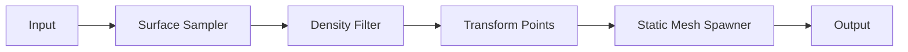

# In-depth tutorial: PCG graph to replace trees on the Main map

This tutorial walks through setting up a PCG (Procedural Content Generation) graph so it **replaces the current trees** on the **Main** map. The result is the medieval village (from Stylized Provencal) surrounded by a procedural forest. You can follow the **script-based** path (recommended) or build the graph **manually** in the Editor.

---

## 1. Introduction and goal

### What we're doing

Replace existing trees on the Main map with a **PCG-generated forest** so the demo has:

- The **medieval village** (buildings, roads, props from Stylized Provencal).
- A **procedural forest** (trees, and optionally rocks) generated by a PCG graph inside a PCG Volume.

The PCG volume defines *where* new trees spawn; it does not automatically delete old trees. You will remove or keep the existing trees as you prefer (see section 2).

### What "current trees" means

**Current trees** are any trees that already exist on Main:

- Trees that came with the **Stylized Provencal Main** template (e.g. Foliage or static mesh instances).
- Trees you placed by hand.

The tutorial explains how to **remove or work around** them so the PCG forest is the sole (or primary) tree source.

### Two paths

| Path | Description |
|------|-------------|
| **A. Script-based (recommended)** | Run `create_demo_map.py` (or `create_pcg_forest.py` with Main open). The script creates the PCG graph, places the volume, and runs Generate. You only configure JSON and run once. |
| **B. Manual (optional)** | Build the same graph by hand in the Editor: create a PCG Graph asset, add nodes, set properties, add a PCG Volume to the level, assign the graph, and Execute. Useful for learning or one-off custom graphs. |

### Prerequisites

- **Main map** exists at `Content/HomeWorld/Maps/Main`. If not, see [DEMO_MAP_SETUP.md](DEMO_MAP_SETUP.md) (duplicate from StylizedProvencal or run `create_demo_map.py` once).
- **Plugins:** **PythonScriptPlugin** and **PCGPythonInterop** enabled in `HomeWorld.uproject` (restart Editor after enabling). See [PCG_FOREST_SETUP.md](PCG_FOREST_SETUP.md).
- **Optional:** Quixel/Megascans tree meshes in the project (e.g. under `Content/Environments/`) for realistic trees; otherwise the script uses placeholder cubes.

---

## 2. Replacing existing trees (before or after PCG)

The PCG **volume** defines where *new* trees spawn. It does **not** auto-delete existing tree actors. Cleaning the level is a **manual step**.

### Option A – Remove existing trees first

1. Open **Main** (Content/HomeWorld/Maps/Main).
2. Open **World Outliner** (Window → World Outliner).
3. Find tree-related actors: filter or search for **Foliage**, **StaticMeshActor**, or template-specific names (e.g. "Tree", "SM_Tree"). The Stylized Provencal map may use Foliage Type instances or placed static meshes.
4. Select the tree actors you want to remove (e.g. in the forest area around the village). Delete (Delete key) or move them to a hidden layer so the level only shows village + PCG forest.
5. Save the level. Then run the PCG script (section 3) so new trees spawn in the same area.

### Option B – PCG first, then clean

1. Run the PCG script (section 3) to add the forest.
2. In World Outliner, find and delete (or hide) the *old* tree actors so the final look is only the PCG trees.

**Recommendation:** Removing old trees avoids overlapping density and keeps the scene clear. Either order works; do the cleanup step once.

---

## 3. Script-based setup (recommended path)

### Step 1 – Open Main

- **Option 1:** In the Editor, **File → Open Level** (or Content Browser) and open **Content/HomeWorld/Maps/Main**.
- **Option 2:** Run **Tools → Execute Python Script** and choose `Content/Python/create_demo_map.py`. The script will try to open Main if it is not the current level.

### Step 2 – Config (volume and meshes)

#### Volume (where trees spawn)

Edit [Content/Python/demo_map_config.json](../Content/Python/demo_map_config.json):

- **volume_center_x, volume_center_y, volume_center_z** — Center of the PCG volume in world space (cm). Default `0, 0, 0`. If the village is at origin, this is fine; otherwise set the center so the forest box is where you want it.
- **volume_extent_x, volume_extent_y, volume_extent_z** — **Half-extents** in cm. Default `5000, 5000, 500` ⇒ a box 100 m × 100 m × 10 m. To cover a larger area (e.g. forest around the whole village), increase extent (e.g. `10000, 10000, 500` for 200×200 m).

The volume should **enclose the area where trees should replace the old ones**. It does not “cut out” the village; points are filtered by density and height only. For fewer trees inside the village, use a larger volume so the forest surrounds the village, then manually delete any stray instances inside buildings if needed.

#### Tree meshes

Edit [Content/Python/pcg_forest_config.json](../Content/Python/pcg_forest_config.json):

- **static_mesh_spawner_meshes** — Array of mesh asset paths (strings). Example: `["/Game/Environments/Forest/SM_Tree_01", "/Game/Environments/Forest/SM_Tree_02"]`.
- **How to get a path:** In Content Browser, right-click the static mesh → **Copy Reference**. Paste into the JSON array. Megascans trees often live under **Content/Environments/**.
- Leave the array **empty** to use engine placeholder meshes (cubes) until you add real trees.

Optional:

- **static_mesh_spawner_meshes_rocks** — Rock mesh paths for the optional second spawner (density 0.01).
- **height_filter_min**, **height_filter_max** — World Z in cm so instances spawn only on terrain. Set both to numbers to enable; in the graph you may need to set the filter’s target attribute to **Position.Z** in the Editor.

### Step 3 – Run the script

1. **Tools → Execute Python Script**.
2. Choose **Content/Python/create_demo_map.py** (project root).
3. The script will:
   - Ensure Main exists and open it if needed.
   - Create the PCG graph at `/Game/HomeWorld/PCG/ForestIsland_PCG`.
   - Place a PCG Volume in the level using the center and extent from `demo_map_config.json`.
   - Assign the graph to the volume and run **Generate**.
   - Save the level.

Alternatively, with Main already open you can run **Content/Python/create_pcg_forest.py** and then place the volume manually, or run the demo script which does both.

### Step 4 – Verify

- The level should show a **PCG Volume** (box) and **generated instances** (trees or placeholder cubes).
- **Fly:** Hold **E + WASD** to move around and confirm coverage.
- If you see **placeholder cubes** instead of trees, add tree mesh paths to `static_mesh_spawner_meshes` in `pcg_forest_config.json` and re-run the script (the script recreates the graph and picks up the new meshes).
- Optionally **remove old trees** (section 2) so only the PCG forest remains.

---

## 4. In-depth: PCG graph nodes (what the script creates)

Understanding the graph helps you tweak it in the Editor or adjust the script/config.

### Node flow

Optional: a **Height Filter** (or Attribute Filter on Position.Z) can sit between Surface Sampler and Density Filter. An optional **Rocks** branch (second Surface Sampler → Density → Transform → Spawner) merges at Output.

### Input → Surface Sampler

- **Role:** Samples **points** on the surface of the PCG Volume (or another bounds source). Each point can become one instance (e.g. one tree).
- **Key settings:**
  - **Points Per Squared Meter** = **0.05** (script default). Higher = denser trees; lower = sparser (e.g. 0.02 for fewer trees).
  - **Bounds** = PCG Volume when the graph is executed on that volume. The volume’s **position and size in the level** directly control where trees can spawn.

### Surface Sampler → Density Filter

- **Role:** Keeps only points whose **density** value is in range. Removes points that are too dense or too sparse, creating natural gaps.
- **Key settings:** **Min** = **0.3**, **Max** = **1.0** (script default). This avoids a uniform grid and gives a more natural forest distribution.

### Density Filter → Transform Points

- **Role:** Applies **random rotation** and **scale** to each point so trees don’t all look identical.
- **Key settings:**
  - **Rotation:** e.g. Yaw 0–360° (script sets rotation_min/max).
  - **Scale:** **0.8–1.2** uniform (script default).
  - **Seed:** Fixed integer for reproducible results (script uses 12345 for trees, 54321 for rocks).

### Transform Points → Static Mesh Spawner

- **Role:** Spawns a **static mesh** at each point. The mesh list comes from `pcg_forest_config.json` or the Editor.
- **Key settings:** **Mesh list** = from config. The script uses **weighted** selection (equal weight per mesh when multiple are listed). If the list is empty, the script falls back to a placeholder cube.

### Optional nodes

- **Height Filter (Attribute Filter on Position.Z):** Use when the level has terrain and you want trees only on the surface. Set `height_filter_min` and `height_filter_max` in config; in the graph you may need to set the filter’s **target attribute** to **Position.Z** in the Editor.
- **Rocks branch:** A second pipeline (Surface Sampler with **0.01** points/m², same Density Filter and Transform, then a second Static Mesh Spawner) when `static_mesh_spawner_meshes_rocks` is set in config. Merges at the graph Output.

---

## 5. Volume placement for the Main map

### Where to put the volume

Main is the medieval village; trees should **surround** (or replace trees around) the village. The volume should **enclose the area where trees are desired** (e.g. the whole playable area or a large ring around the village).

### Units

Unreal uses **centimeters**. In config, **5000** = 50 m **half-extent** ⇒ **100 m** total per axis. Default extent `5000, 5000, 500` ⇒ 100 m × 100 m × 10 m box.

### Sizing

- **Larger forest:** In `demo_map_config.json`, increase `volume_extent_x` and `volume_extent_y` (e.g. **10000, 10000** for 200×200 m).
- **Center:** If the village is at world origin, center **0, 0, 0** is fine. Otherwise set `volume_center_x/y/z` so the box is centered where you want the forest.

### Excluding the village

PCG does **not** “cut out” the village by default; points are filtered by density and height, not by “no buildings.” Options:

1. **Accept some overlap:** Keep the volume large; a few trees may appear near buildings. Manually delete those instances or paint them out later.
2. **Exclusion later:** Use a PCG exclusion volume or manual cleanup in a follow-up pass.
3. **Exclusion zones (programmatic):** Add **exclusion_zones** to [Content/Python/demo_map_config.json](../Content/Python/demo_map_config.json): an array of boxes where no trees should spawn. Each object has **center_x**, **center_y**, **center_z** and **extent_x**, **extent_y**, **extent_z** (cm, half-extents). After re-running the demo map script (`Content/Python/create_demo_map.py`), the graph uses a **Difference** node to remove points inside those boxes, so no trees are generated there. One box can cover the village (e.g. 40×40 m ⇒ extent 2000, 2000, 500); add more entries for roads or other no-tree areas. The script also spawns exclusion volume actors in the level for reference; if the graph’s exclusion point source is not wired automatically, connect a Surface Sampler (bounds = exclusion volume) to the Difference node’s **Difference** pin in the Editor (see script log).

---

## 6. Manual graph setup (optional)

If you want to build the graph **by hand** in the Editor (no script):

1. In Content Browser, **Right-click** in `Content/HomeWorld/PCG` → **Miscellaneous → PCG Graph**. Name it (e.g. `Forest_Main_PCG`).
2. Open the graph. Add nodes in order:
   - **Surface Sampler** → **Density Filter** → **Transform Points** → **Static Mesh Spawner**.
   - Connect **Input** → Surface Sampler → Density Filter → Transform Points → Spawner → **Output**.
3. Set each node’s properties to match the script defaults (see section 4): Surface 0.05 points/m², Density 0.3–1.0, Transform rotation/scale 0.8–1.2, Spawner meshes from your assets.
4. In the level, add a **PCG Volume** (Place Actors → PCG Volume). Set its **bounds** (e.g. 100 m × 100 m in Details). Assign your graph to the volume’s **PCG Component**.
5. Click **Generate** (or **Execute Graph** from the graph asset). Wait 5–10 seconds.

The script produces the same result and is faster for iteration; manual setup is for learning or one-off custom graphs.

---

## 7. Execute and validate

### Execute

- **From script:** Generate runs automatically after the script places the volume and assigns the graph.
- **From Editor:** Select the **PCG Volume** in the level; in **Details** find the PCG component and use **Generate**. Or open the graph asset and click **Execute Graph** (Play button top-left). Allow **5–10 seconds** for generation.

### Validate

- **Rough count:** About **50–100+** trees (depending on volume size and density).
- **Output Log:** No errors.
- **Fly:** E + WASD to confirm placement and that trees replace (or sit where) the old trees were.
- **Placeholders:** If you see cubes instead of trees, add mesh paths to `pcg_forest_config.json` and re-run the script (or update the spawner in the graph and re-execute).

---

## 8. Troubleshooting

| Issue | What to check |
|-------|----------------|
| **No instances / empty volume** | Volume too small or density too low. Check **Points Per Squared Meter** (e.g. 0.05) and **volume extent** in config. Ensure the level is saved and the graph is assigned to the volume. |
| **Placeholder cubes instead of trees** | No mesh paths in config or meshes failed to load. Add valid paths (Content Browser → right-click mesh → Copy Reference) to `static_mesh_spawner_meshes` in [pcg_forest_config.json](../Content/Python/pcg_forest_config.json). |
| **Trees in the sky or underground** | Use the **height filter** (set `height_filter_min` and `height_filter_max` in config and set the filter’s target attribute to **Position.Z** in the graph). Or check that the surface/terrain is where you expect. |
| **Script "No editor world"** | Open **Main** (Content/HomeWorld/Maps/Main) before running the script. |
| **Re-run creates new graph** | The script **deletes** the existing graph and recreates it. Config changes (meshes, density) take effect on the next run. |

---

## 9. Summary and next steps

**Recap:** Run the script (or build the graph manually) → set volume and mesh config → execute → remove old trees if desired → validate.

**Next steps:**

- Add **Megascans trees** to [pcg_forest_config.json](../Content/Python/pcg_forest_config.json).
- Tune **volume** size and position in [demo_map_config.json](../Content/Python/demo_map_config.json).
- Enable **World Partition** if needed (see [PCG_FOREST_SETUP.md](PCG_FOREST_SETUP.md)).
- Optional: **rocks** (`static_mesh_spawner_meshes_rocks`) and **height filter** for terrain-only spawn.

**See also:**

- [PCG_FOREST_SETUP.md](PCG_FOREST_SETUP.md) — Script defaults, config, and run steps.
- [DEMO_MAP_SETUP.md](DEMO_MAP_SETUP.md) — Demo map goal and `create_demo_map.py` workflow.
