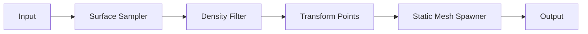
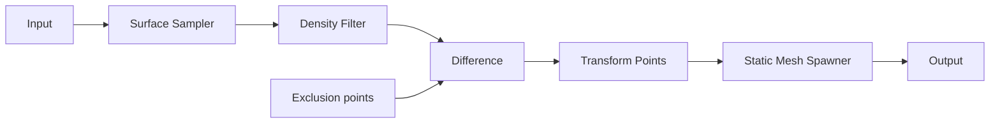

# PCG forest setup: add volumes in the Editor and customize

This tutorial is a **step-by-step guide** to adding a **procedural forest** to the Main map using PCG (Procedural Content Generation): create a PCG Graph, add a PCG Volume (and optionally exclusion volumes for dead zones), then customize and generate. The **Editor path** is the main flow; the **script path** is an optional shortcut that creates the same graph and volume from config files.

---

## 1. Introduction and goal

### What we're doing

Add a **PCG-generated forest** to the Main map so the demo has:

- The **medieval village** (buildings, roads, props from Stylized Provencal).
- A **procedural forest** (trees, and optionally rocks) generated by a PCG graph inside a PCG Volume.

You will create the PCG Graph asset, add and wire nodes, place a PCG Volume in the level, assign the graph, and generate. Optionally you can add exclusion volumes (dead zones) so no trees spawn in the village or other areas.

### Two paths

| Path | Description |
|------|-------------|
| **A. Editor (step-by-step)** | Build the graph and add volumes in the Unreal Editor: create the PCG Graph, add nodes, set properties, place PCG Volume(s), assign the graph, and Generate. Full control and learning. |
| **B. Script (optional shortcut)** | Run `create_demo_map.py`. The script creates the same graph and volume from [demo_map_config.json](../Content/Python/demo_map_config.json) and [pcg_forest_config.json](../Content/Python/pcg_forest_config.json). Use this for fast iteration once you know the options. |

### Prerequisites

- **Main map** exists at `Content/HomeWorld/Maps/Main`. If not, see [DEMO_MAP_SETUP.md](DEMO_MAP_SETUP.md).
- **Plugins (for script path only):** **PythonScriptPlugin** and **PCGPythonInterop** enabled in `HomeWorld.uproject`; see [PCG_FOREST_SETUP.md](PCG_FOREST_SETUP.md).
- **Tree meshes:** Optional at first; you can use placeholder meshes until you add assets (e.g. from Content Browser or Megascans).

---

## 2. Legacy tree actors (optional note)

If your level still has **existing tree actors** (Foliage, StaticMeshActor, or template trees), remove them in **World Outliner** (Window → World Outliner): search for "Tree", "Foliage", or "SM_Tree", select, and delete (or move to a hidden layer) so only the PCG forest is visible. The PCG volume does not remove old actors automatically.

---

## 3. Add PCG volumes in the Editor (step-by-step)

Follow these steps to create the forest graph and place the volume in the level.

### Step 1 – Create the PCG Graph asset

1. In **Content Browser**, navigate to (or create) the folder **Content/HomeWorld/PCG**.
2. **Right-click** in the folder → **Miscellaneous → PCG Graph** (or **Procedural → PCG Graph** if your engine uses that menu). Name it (e.g. `Forest_Main_PCG`).
3. **Double-click** the asset to open the graph editor.

### Step 2 – Add and wire the main nodes

1. In the graph editor, **right-click** in the canvas (or use the node palette) and add nodes. Add them in this order:
   - **Input** (may already exist) → **Surface Sampler** → **Density Filter** → **Transform Points** → **Static Mesh Spawner** → **Output**.
2. **Connect** the pins in order:
   - **Input** → **Surface Sampler** (e.g. Out → In).
   - **Surface Sampler** → **Density Filter**.
   - **Density Filter** → **Transform Points**.
   - **Transform Points** → **Static Mesh Spawner**.
   - **Static Mesh Spawner** → **Output**.

If your engine uses different pin names (e.g. "Out" / "In"), connect the main output of each node to the input of the next.

### Step 3 – Set node properties (defaults)

Select each node and set these in **Details**:

| Node | Property | Value |
|------|----------|--------|
| **Surface Sampler** | **Points Per Squared Meter** | **0.05** (density; increase for more trees, decrease for fewer). |
| | **Bounds** | Leave default or set to the PCG Volume when the graph runs on that volume (often automatic). |
| **Density Filter** | **Min** | **0.3** |
| | **Max** | **1.0** |
| **Transform Points** | **Rotation** (Yaw) | e.g. 0–360° |
| | **Scale** (uniform) | **0.8** to **1.2** |
| | **Seed** | e.g. **12345** (fixed for reproducible results). |
| **Static Mesh Spawner** | **Mesh list** | Add your tree static meshes: drag from Content Browser into the list, or use **+** and pick assets. Leave empty to use placeholders if supported. |

### Step 4 – Add the main PCG Volume to the level

1. Open your level (e.g. **Main**: Content/HomeWorld/Maps/Main).
2. **Place Actors** (or **Window → Place Actors**) → **Volumes** → **PCG Volume** (or search "PCG Volume"). Drag into the viewport or place at origin.
3. With the PCG Volume selected, in **Details**:
   - **Transform → Location:** Set the center of the forest (e.g. **0, 0, 0** if the village is at origin).
   - **Bounds** (or **Brush / Box extent**): Unreal uses **centimeters**. Half-extents **5000, 5000, 500** ⇒ 100 m × 100 m × 10 m box. Adjust to cover the area where trees should spawn.

### Step 5 – Assign graph and generate

1. With the **PCG Volume** selected, in **Details** find the **PCG** component (or **PCG Component**).
2. Set **Graph** (or **PCG Graph**) to your asset (e.g. `Forest_Main_PCG`).
3. Click **Generate** (on the component or in the graph editor toolbar). Wait a few seconds; tree instances (or placeholders) should appear in the volume.

### Step 6 (optional) – Dead zones (exclusion volumes)

To keep trees **out** of the village or other areas:

1. **In the graph:** Insert a **Difference** node between **Density Filter** and **Transform Points**. Re-wire: **Density Filter** → **Difference** (main input); **Difference** → **Transform Points**.
2. **In the level:** Add one or more **PCG Volume**(s) that cover the no-tree areas (e.g. village). Resize and position each in **Details** (Transform, Bounds). Optionally name them (e.g. "Exclusion_Village").
3. **In the graph:** For each exclusion volume, add a **Surface Sampler** (or equivalent point source). Set its **Bounds** to reference the corresponding PCG Volume actor in the level. Connect this node’s **Out** to the **Difference** node’s **Difference** (or **Differences**) pin.
4. **Generate** again; no trees should appear inside the exclusion volumes.

---

## 4. How to customize it

Use this section to jump to what you want to change. All of these are done in the **Editor** (graph or level); script users can achieve the same via the config files and re-running the script (see section 5).

| What to customize | Where (Editor) | Key settings |
|-------------------|----------------|--------------|
| **Forest area and position** | PCG Volume actor in level | **Transform → Location**; **Bounds** (half-extents in cm). |
| **Tree density** | Surface Sampler node | **Points Per Squared Meter** (e.g. 0.02 = sparser, 0.08 = denser). |
| **Natural gaps** | Density Filter node | **Min** / **Max** (e.g. 0.3–1.0). |
| **Tree size and rotation** | Transform Points node | **Scale** min/max, **Rotation** (Yaw, etc.), **Seed**. |
| **Which meshes** | Static Mesh Spawner node | **Mesh list**: add/remove static meshes (drag from Content Browser or use +). |
| **No trees in village** | Dead zones (optional) | **Difference** node + exclusion **PCG Volume**(s) + point source wired to Difference (see Step 6 above). |
| **Terrain-only spawn** | Optional | **Height Filter** or **Attribute Filter** on **Position.Z** between Surface Sampler and Density Filter. |
| **Rocks / second spawner** | Optional | Second branch: Surface Sampler (e.g. 0.01 points/m²) → Density → Transform → Static Mesh Spawner; merge at **Output**. |

### Units

Unreal uses **centimeters**. Half-extent **5000** = 50 m ⇒ **100 m** total per axis. Example: **5000, 5000, 500** ⇒ 100 m × 100 m × 10 m box.

### Script users

The same customization is available via [Content/Python/demo_map_config.json](../Content/Python/demo_map_config.json) (volume center/extent, exclusion_zones) and [Content/Python/pcg_forest_config.json](../Content/Python/pcg_forest_config.json) (mesh list, optional rocks, height filter). Edit those and re-run **create_demo_map.py** to apply changes.

---

## 5. Script-based setup (optional shortcut)

To create the same graph and volume **without building the graph by hand**:

1. Open **Main** (Content/HomeWorld/Maps/Main).
2. Edit **[Content/Python/demo_map_config.json](../Content/Python/demo_map_config.json):** `volume_center_x/y/z`, `volume_extent_x/y/z` (cm), and optionally `exclusion_zones` (array of center + extent per dead zone).
3. Edit **[Content/Python/pcg_forest_config.json](../Content/Python/pcg_forest_config.json):** `static_mesh_spawner_meshes` (tree mesh paths), and optionally rocks and height filter.
4. **Tools → Execute Python Script** → choose **Content/Python/create_demo_map.py**. The script creates the graph, places the volume, assigns the graph, and runs Generate.

For full config details and run options, see [DEMO_MAP_SETUP.md](DEMO_MAP_SETUP.md) and [PCG_FOREST_SETUP.md](PCG_FOREST_SETUP.md).

---

## 6. In-depth: PCG graph nodes (reference)

Understanding the graph helps when customizing in the Editor.

### Node flow

**Without exclusion zones:**

**With exclusion zones (dead zones):**

### Node roles

- **Input → Surface Sampler:** Samples points on the PCG Volume surface. **Points Per Squared Meter** and **Bounds** control density and area. In Editor: add from palette (search "Surface Sampler").
- **Surface Sampler → Density Filter:** Keeps points in a density range (e.g. Min 0.3, Max 1.0) for natural gaps.
- **Density Filter → [Difference] → Transform Points:** With dead zones, **Difference** removes points inside exclusion volumes. **Transform Points** applies random rotation and scale (Yaw, scale 0.8–1.2, Seed).
- **Transform Points → Static Mesh Spawner:** Spawns a static mesh at each point. **Mesh list** in Details (add from Content Browser).
- **Optional:** Height Filter (or Attribute Filter on Position.Z) for terrain-only spawn; second branch (Surface Sampler → … → Spawner) for rocks, merged at Output.

---

## 7. Execute and validate

### Execute

- **From level:** Select the **PCG Volume** in the level → **Details** → PCG component → **Generate**.
- **From graph:** Open the PCG Graph asset → **Execute Graph** (Play button in toolbar). Allow **5–10 seconds** for generation.

### Validate

- **Rough count:** About **50–100+** trees (depending on volume size and density).
- **Output Log:** No errors.
- **Fly:** E + WASD to confirm placement.
- **Placeholders:** If you see cubes instead of trees, add meshes to the Static Mesh Spawner in the graph (or set `static_mesh_spawner_meshes` in config and re-run the script).

---

## 8. Troubleshooting

| Issue | What to check |
|-------|----------------|
| **No instances / empty volume** | Volume too small or density too low. Check **Points Per Squared Meter** (e.g. 0.05) and volume **Bounds**. Ensure the **graph is assigned** to the PCG Volume and the level is saved. |
| **No graph or volume in level** | Add a PCG Volume from Place Actors → Volumes → PCG Volume. Assign your PCG Graph asset to the volume’s PCG component. |
| **Placeholder cubes instead of trees** | Add static meshes to the **Static Mesh Spawner** node (Mesh list in Details), or in config set `static_mesh_spawner_meshes` in [pcg_forest_config.json](../Content/Python/pcg_forest_config.json) and re-run the script. |
| **Trees in the sky or underground** | Add a **Height Filter** or **Attribute Filter** on **Position.Z**; or check terrain/surface position. |
| **Script "No editor world"** | Open **Main** (Content/HomeWorld/Maps/Main) before running the script. |
| **Re-run creates new graph** | The script deletes and recreates the graph. Config changes take effect on the next run. |
| **Trees still in village / dead zone** | Add a **Difference** node and exclusion PCG Volume(s); wire the exclusion point source to the Difference node’s **Difference** pin. Script users: set **exclusion_zones** in [demo_map_config.json](../Content/Python/demo_map_config.json) and re-run. |

---

## 9. Summary and next steps

**Recap:** Add the PCG Graph (create asset, add nodes, set properties) → place PCG Volume in the level → assign graph → optionally add exclusion volumes and Difference node → **Generate** → validate. Or use the script (section 5) for a quick setup from config.

**Next steps:**

- Add **tree meshes** to the Static Mesh Spawner (or to `static_mesh_spawner_meshes` in config).
- **Tune** volume size and position, density (Points Per Squared Meter), and dead zones as needed.
- Enable **World Partition** if needed (see [PCG_FOREST_SETUP.md](PCG_FOREST_SETUP.md)).
- Optional: **rocks** (second spawner branch) and **height filter** for terrain-only spawn.

**See also:**

- [PCG_FOREST_SETUP.md](PCG_FOREST_SETUP.md) — Script defaults and config; full Editor step-by-step and customization are in this tutorial.
- [DEMO_MAP_SETUP.md](DEMO_MAP_SETUP.md) — Demo map and `create_demo_map.py` workflow; link to this tutorial for adding and customizing PCG volumes in the Editor.
