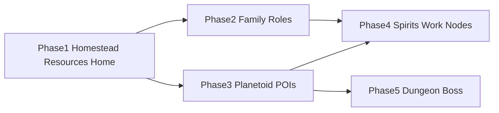

# Homestead & Planetoid Implementation Roadmap

Implementation roadmap to reach a playable slice: **homestead generated**, **resource collection**, **home assets placed**, **family with roles** (attack/defend, support/healer, child), **planetoid with POIs** (shrines, treasure, cultivation, mining), **command spirits to work nodes**, and a **dungeon with boss**.

Aligns with [CAMPAIGN_VISION.md](../CAMPAIGN_VISION.md) (homestead opening, family, death = spirit, child succession) and [PLANETOID_DESIGN.md](../PLANETOID_DESIGN.md) (per-planetoid identity, surface + layers, non-deformable).

---

## Target State (Summary)

| Area | Target |
|------|--------|
| Homestead | Generated (PCG or authored); recognizable “home” space. |
| Resources | Collection loop: harvest piles/nodes, use for building/crafting. |
| Home assets | Placed in homestead (walls, beds, farms, etc.) via placement API and/or agentic building. |
| Family roles | **Attack/defend** (protector), **Support/healer**, **Child** (distinct behavior/abilities). |
| Planetoid | One (or first) planetoid generated with distinct biome; visitable from homestead (portal/sublevel). |
| POIs | **Shrines**, **treasure**, **cultivation sections**, **mining sections** as visitable nodes. |
| Spirits | Dead characters become spirits; player can **command spirits to work** on cultivation/mining (and optionally other) nodes. |
| Dungeon | One **dungeon** POI with a **boss** encounter. |

**Daily breakdown:** See [HOMESTEAD_DAILY_ROADMAP.md](HOMESTEAD_DAILY_ROADMAP.md) for day-by-day task lists.

---

## Phase 1: Homestead Generation, Resources, Home Placement

**Goal:** Homestead exists, resources can be collected, home assets can be placed (player and/or agents).

**Dependencies:** Existing C++ ([AHomeWorldBuildOrder](../Source/HomeWorld/HomeWorldBuildOrder.h), [AHomeWorldResourcePile](../Source/HomeWorld/HomeWorldResourcePile.h), [UBuildPlacementSupport](../Source/HomeWorld/BuildPlacementSupport.h)), PCG ([PCG_SETUP.md](../PCG_SETUP.md)), [CONTENT_LAYOUT.md](../CONTENT_LAYOUT.md).

| # | Task | Type | Effort | Description |
|---|------|------|--------|-------------|
| 1.1 | Homestead layout (PCG or authored) | **Programmatic** or **Manual** | Medium | Define homestead bounds (e.g. PCG Volume or level blockout). **Programmatic:** PCG graph that places “homestead” landmarks (foundation, yard); or Python/MCP to place a boundary. **Manual:** Author a “Homestead” level or sublevel with a clear home zone. **Homestead map option:** The Homestead map and [HOMESTEAD_MAP.md](../HOMESTEAD_MAP.md) implement the authored map + placeholders + PCG option. |
| 1.2 | Resource nodes in/around homestead | **Programmatic** | Low–Medium | Place or spawn [AHomeWorldResourcePile](../../Source/HomeWorld/HomeWorldResourcePile.h) (e.g. BP_WoodPile) in homestead or adjacent area. Use existing ResourceType, AmountPerHarvest. Harvest via Smart Object or interaction (see [AGENTIC_BUILDING.md](AGENTIC_BUILDING.md) BP_WoodPile + SO). |
| 1.3 | Resource collection loop (player) | **Programmatic** | Medium | Player can harvest resource piles: interaction/GAS ability that grants resource (inventory or attribute). Stub: `UHomeWorldInventorySubsystem` or GAS attribute “Wood”; on harvest add amount. |
| 1.4 | Home asset placement (player) | **Programmatic** | Low–Medium | Use [GetPlacementHit](../../Source/HomeWorld/BuildPlacementSupport.h) / GetPlacementTransform to place build orders (e.g. BP_BuildOrder_Wall) or direct home props in homestead. Input: place key → trace → spawn actor at hit. |
| 1.5 | Optional: agentic building | **Manual** + **Programmatic** | High | Family agents fulfill build orders (see [AGENTIC_BUILDING.md](AGENTIC_BUILDING.md)): SO_WallBuilder, State Tree BUILD branch, EQS. Complete after Phase 2 if family roles are prioritized. |

**Exit criterion:** Homestead exists; player can harvest at least one resource type and place at least one home asset (e.g. wall or prop).

---

## Phase 2: Family Roles (Attack/Defend, Healer, Child)

**Goal:** Family members with distinct roles: **attack/defend** (protector), **support/healer**, **child** (different behavior and abilities).

**Dependencies:** [FAMILY_AGENTS_MASS_STATETREE.md](FAMILY_AGENTS_MASS_STATETREE.md) (Mass + State Tree), GAS ([STACK_PLAN.md](../STACK_PLAN.md) Layer 3), [AHomeWorldAIController](../../Source/HomeWorld/HomeWorldAIController.h).

| # | Task | Type | Effort | Description |
|---|------|------|--------|-------------|
| 2.1 | Family spawn in homestead | **Programmatic** | Medium | Spawn N family members (Mass or actor-based) in homestead at start. Use existing MEC/State Tree or place AHomeWorldAIController-driven pawns; tag or role ID per member. |
| 2.2 | Role: Attack/Defend (Protector) | **Programmatic** | Medium | One or more family members: State Tree or BT that prioritizes combat, defends homestead/player. GAS: combat abilities, taunt or aggro. Data: Role = Protector. |
| 2.3 | Role: Support/Healer | **Programmatic** | Medium | One or more family members: behavior that prioritizes healing/buffing player or allies. GAS: heal ability, support buffs. Data: Role = Healer. |
| 2.4 | Role: Child | **Programmatic** | Medium | One or more “child” members: non-combat or limited combat; follow player, use safe nodes (e.g. cultivation later). Data: Role = Child; distinct mesh/anim or tag. |
| 2.5 | Role assignment and persistence | **Programmatic** | Low–Medium | Store role per family member (GameState, SaveGame, or subsystem). Assign at spawn; readable by UI and AI. |

**Exit criterion:** Homestead has at least one Protector, one Healer, one Child; each behaves according to role (even if stub abilities).

---

## Phase 3: Planetoid Generation and POIs (Shrines, Treasure, Cultivation, Mining)

**Goal:** One planetoid (or first of 7) generated with **points of interest**: shrines, treasure, cultivation sections, mining sections; player can visit and interact.

**Dependencies:** [PLANETOID_DESIGN.md](../PLANETOID_DESIGN.md), PCG, World Partition. Homestead (Phase 1) as “home”; portal or travel to planetoid (sublevel or streamed level).

| # | Task | Type | Effort | Description |
|---|------|------|--------|-------------|
| 3.1 | Planetoid level / sublevel | **Manual** + **Programmatic** | Medium | Create one planetoid level (Landscape + World Partition) or sublevel; travel from homestead via portal, door, or map. Per [PLANETOID_DESIGN.md](../PLANETOID_DESIGN.md): one identity, surface biome. |
| 3.2 | PCG POI placement (high level) | **Programmatic** | Medium | PCG graph (or graph params) that places **POI actors** with density/radius: Shrine, Treasure, CultivationNode, MiningNode. Each POI type = actor or blueprint with tag/ID. |
| 3.3 | Shrine POI | **Programmatic** | Low | Shrine actor: placeable by PCG; interaction or GAS (e.g. blessing, moral alignment). Stub: AHomeWorldShrine or Blueprint with interaction. |
| 3.4 | Treasure POI | **Programmatic** | Low | Treasure actor: loot on interact; reward (resource, item). Stub: AHomeWorldTreasure or Blueprint. |
| 3.5 | Cultivation section | **Programmatic** | Medium | Cultivation “node” or zone: actor that spirits/agents can “work” (Phase 4); yields resources over time. Stub: AHomeWorldCultivationNode with Work() / Progress. |
| 3.6 | Mining section | **Programmatic** | Medium | Mining “node” or zone: same idea as cultivation; workable by spirits/agents; yields ore/stone. Stub: AHomeWorldMiningNode. |
| 3.7 | Visit and interact | **Programmatic** | Medium | Player can travel to planetoid, reach POIs, and interact (harvest treasure, activate shrine, later command spirits to work cultivation/mining). |

**Exit criterion:** One planetoid loadable from homestead; POIs (shrine, treasure, cultivation, mining) placed and interactable at a basic level.

---

## Phase 4: Spirit System and Command Spirits to Work Nodes

**Goal:** When a character dies they become a **spirit** (no longer playable). Player can **command spirits** to work on **nodes** (cultivation, mining).

**Dependencies:** [CAMPAIGN_VISION.md](../CAMPAIGN_VISION.md) (death = spirit); Phase 3 (cultivation/mining nodes).

| # | Task | Type | Effort | Description |
|---|------|------|--------|-------------|
| 4.1 | Death → spirit conversion | **Programmatic** | Medium | On character death: mark as spirit, remove from playable roster, optionally spawn “spirit” actor or store in subsystem. Per campaign: spirit is no longer playable. |
| 4.2 | Spirit roster / list | **Programmatic** | Low–Medium | Subsystem or GameState: list of spirits (by character ID or name). UI or command interface can show “available spirits.” |
| 4.3 | Command: assign spirit to node | **Programmatic** | Medium | Player action: “Assign spirit to [CultivationNode/MiningNode].” Spirit (as abstract worker or agent) contributes to that node’s progress. Implementation: spirit ID + node ID stored; node’s Work() ticks or is driven by spirit count. |
| 4.4 | Node progress and yield | **Programmatic** | Medium | Cultivation and mining nodes: when worked by N spirits (and optionally time), produce resources; player can collect. Integrate with resource loop (Phase 1). |
| 4.5 | Unassign / reclaim spirit | **Programmatic** | Low | Player can unassign spirit from a node (spirit becomes “idle” for reassignment). |

**Exit criterion:** At least one character can die and become a spirit; player can command that spirit to work a cultivation or mining node and see progress/yield.

---

## Phase 5: Dungeon and Boss

**Goal:** One **dungeon** POI on the planetoid with a **boss** encounter; player (and optionally family) can enter, fight boss, and complete.

**Dependencies:** Phase 3 (planetoid, POIs); GAS combat; family roles (Phase 2) optional for duo.

| # | Task | Type | Effort | Description |
|---|------|------|--------|-------------|
| 5.1 | Dungeon as POI | **Programmatic** or **Manual** | Medium | Dungeon = POI type (like shrine/treasure): entrance actor or trigger; on interact, load dungeon sublevel or stream dungeon content. Can be PCG-placed “DungeonEntrance” or authored. |
| 5.2 | Dungeon interior | **Manual** + **Programmatic** | High | Interior layout: authored or PCG (corridors, arena). Boss arena at end. Use existing GAS for combat. |
| 5.3 | Boss actor and abilities | **Programmatic** | High | Boss pawn with GAS: health, abilities, phase or mechanics. Spawn in arena when player enters. On death: drop loot, mark dungeon complete. |
| 5.4 | Dungeon complete / reward | **Programmatic** | Low–Medium | On boss death: grant reward (treasure, key, story flag); optional respawn or one-time. |

**Exit criterion:** Player can enter dungeon from planetoid, fight boss, and receive completion reward.

---

## Dependency Overview

- **Phase 1** must be done first (homestead, resources, placement).
- **Phase 2** (family roles) and **Phase 3** (planetoid + POIs) can proceed in parallel after Phase 1.
- **Phase 4** (spirits, command to work nodes) needs Phase 2 (spirits from death) and Phase 3 (nodes).
- **Phase 5** (dungeon + boss) needs Phase 3 (planetoid to attach dungeon to).

---

## References

- [CAMPAIGN_VISION.md](../CAMPAIGN_VISION.md) – Homestead opening, family, death = spirit, child succession.
- [PLANETOID_DESIGN.md](../PLANETOID_DESIGN.md) – Planetoid generation (Astroneer-inspired, non-deformable).
- [STACK_PLAN.md](../STACK_PLAN.md) – PCG, GAS, building, family AI.
- [AGENTIC_BUILDING.md](AGENTIC_BUILDING.md) – Build orders, SO_WallBuilder, BP_WoodPile.
- [FAMILY_AGENTS_MASS_STATETREE.md](FAMILY_AGENTS_MASS_STATETREE.md) – Mass + State Tree family setup.
- C++: [HomeWorldBuildOrder.h](../../Source/HomeWorld/HomeWorldBuildOrder.h), [HomeWorldResourcePile.h](../../Source/HomeWorld/HomeWorldResourcePile.h), [BuildPlacementSupport.h](../../Source/HomeWorld/BuildPlacementSupport.h).
